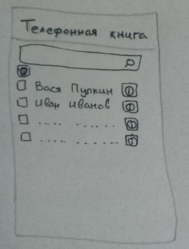
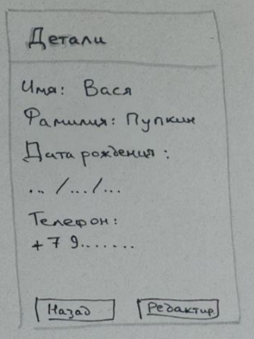
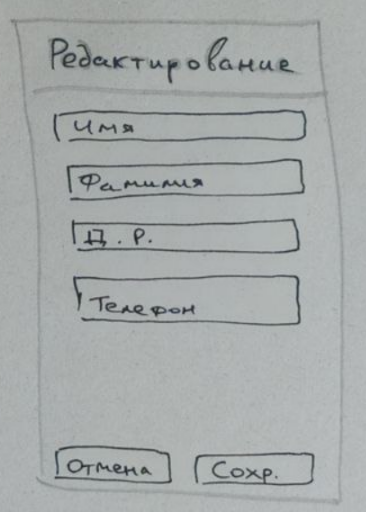

# Лекции по разработке на Android
* Язык Kotlin:
  * [Основы языка](https://dmitryweiner.github.io/android-lectures/Kotlin-basics.html).
  * [Классы, наследование, объекты](https://dmitryweiner.github.io/android-lectures/Kotlin-objects.html).
  * [Коллекции, stream API](https://dmitryweiner.github.io/android-lectures/Kotlin-collections.html).
* [Android Studio. Основы работы. Компиляция в APK](https://dmitryweiner.github.io/android-lectures/Android-studio.html).
* [Анатомия приложения](https://dmitryweiner.github.io/android-lectures/Application-structure.html).
* Разметка:
  * Constraint Layout.
  * Linear Layout.
  * Другие лейауты.
* Работа с компонентами.
  * Виды компонентов.
  * Поиск.
  * Binding.
  * Чтение введённых данных.
  * Реакция на события.
  * Тосты.
  * Диалоги.
* Activity.
  * Жизненный цикл Activity.
  * Навигация между Activity c помощью Intent.
  * Открытие системных элементов: выбор файла (пример).
* Запрос разрешений.
  * Разрешения в Manifest.xml.
  * Запрос разрешений в коде.
  * Запись файлов на SD.
* Сетевые запросы.
  * Без фреймворков.
  * Использование Retrofit.
* Сохранение данных.
  * SQLite.
  * Room.
* Построение архитектуры MVVM.

### Полезные ссылки
* Язык Java:
  * https://metanit.com/java/tutorial/
  * https://ru.code-basics.com/languages/java
  * ["Пишем вместе с Джоном" (англ.) про Java](https://www.youtube.com/c/CodingwithJohn)
* Язык Kotlin:
  * [Документация по Kotlin](https://kotlinlang.org/docs/getting-started.html)
  * [Интерактивный учебник](https://play.kotlinlang.org/koans/Introduction/Hello,%20world!/Task.kt)
  * https://kotlinlang.ru/
  * https://developer.alexanderklimov.ru/android/kotlin/
  * https://bimlibik.github.io/
  * https://exercism.org/tracks/kotlin/exercises
  * https://www.programiz.com/kotlin-programming/examples
* Программирование под Android:
  * https://startandroid.ru/ru/
  * http://developer.alexanderklimov.ru/android/
  * https://developer.android.com/guide
  * https://metanit.com/java/android/
  * https://learntodroid.com/
  * https://github.com/skydoves/android-developer-roadmap
  * [Очень хороший канал на Youtube](https://www.youtube.com/channel/UCofyDdGnCssPNwABNkxLFKg)
  * [Биржа заказов](https://workspace.ru/tasks/mobile-programming/)
  * [20 Open Source проектов](https://apptractor.ru/info/articles/20-open-source-proektov-dlya-android-kotoryie-mogut-nauchit-vas-novomu.html)

# Лабораторная
Реализовать приложение "Записная книжка" для хранения телефонов, даты рождения и другой информации о людях.

## Функциональные требования
* Пользователь может просматривать список людей.
  * Над списком есть поле поиска, при вводе в которое список динамически обновляется
  (поиск по имени и фамилии).
  * Элементы списка содержат checkbox и кнопку [ⓘ].
  * Чекбокс для отметки записей, которые надо удалить 
  * Над списком кнопка [🗑]️удаляет все отмеченные после подтверждающего диалога.
  
  
* При нажатии на кнопку [ⓘ] открывается Activity с подробной информацией:
  * Имя.
  * Фамилия.
  * Номер телефона (при нажатии происходит вызов).
  * День рождения.
  * ...(добавить по желанию)
  * На этом же скрине есть кнопка "редактировать", нажав на которую, пользователь
    попадает на скрин редактирования деталей.
 
  
* Отредактированные данные можно сохранить либо отменить изменения. 
После этого пользователь попадает на главный экран (список обновляется).

  

## Этапы разработки
* Реализовать вывод списка (данные пока задаются статично) через RecyclerView.
* Реализовать переход на скрин с деталями при нажатии на кнопку [ⓘ].
* Реализовать переход на скрин редактирования.
* Реализовать запись и чтение в БД (SQLite).
* Реализовать вызов при клике на телефонный номер.
* Реализовать MVVM (по желанию).
* Реализовать сохранение на внешний сервер (по желанию).

## [Задачи к зачету](questions.md)

