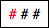
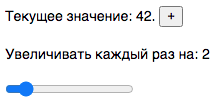
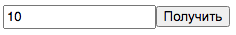
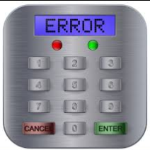
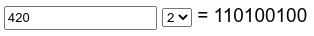
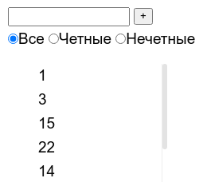

# Задачи для дифференцированного зачета по курсу "Программирование мобильных приложений"

### Число Фибоначчи
Приложение каждую секундую пишет новое [число Фибоначчи](https://ru.wikipedia.org/wiki/%D0%A7%D0%B8%D1%81%D0%BB%D0%B0_%D0%A4%D0%B8%D0%B1%D0%BE%D0%BD%D0%B0%D1%87%D1%87%D0%B8)
вдобавок к уже отображённым. Так, в первую секунду он напишет: 0

> 0, 1

> 0, 1, 1

> 0, 1, 1, 2

> 0, 1, 1, 2, 3

> 0, 1, 1, 2, 3, 5

> 0, 1, 1, 2, 3, 5, 8

### Инвертирование строки
Приложение состоит из поля ввода и кнопки "Перевернуть".
В поле ввода можно ввести строку. При нажатии кнопки строка в поле ввода переворачивается.

### Светофор
Приложение отображает светофор. Время переключения на усмотрение разработчика. Вёрстка не обязательна,
можно отобразить цветные лампы кнопками или TextView:



### Счётчик с переменным шагом
Приложение отображает
* ползунок с текущим значением инкремента,
* кнопку инкремента со знаком +,
* текущее значение счётчика.

При нажатии на кнопку к текущему значению счётчика добавляется столько,
сколько указано ползунком:



### Обращение к сети
Приложение содержит текстовое поле и кнопку "получить":



При нажатии на кнопку происходит обращение к серверу по адресу ```https://jsonplaceholder.typicode.com/todos/:id```,
где ```:id``` &mdash; то, что ввели в текстовое поле.

От сервера приходит:
```json
{
  "userId": 1,
  "id": 1,
  "title": "delectus aut autem",
  "completed": false
}
```

При получении ответа сервера нужно отобразить поле title.

### PIN-код

Приложение рисует панель ввода PIN.

PIN 4-значный, правильный код 9999.

При нажатии кнопок в поле ввода появляются соответствующие цифры.
Количество цифр в поле 4, они перезаписываются циклически 
(было 1234, нажали 5, отображается 2345).

Если ввели правильный PIN, показывается сообщение.



### Калькулятор систем счисления
Калькулятор перевода в другие системы счисления (2, 8, 16). Результат меняется при изменении полей.

  

### Список чисел с фильтрацией
Приложение содержит поле ввода, кнопку "+", выбор режима фильтрации (изначально показываются все числа)
и список чисел (RecyclerView).

При нажатии "+" в список добавляется число из поля ввода, если оно там есть.

При изменении режима фильтрации список обновляется в соответствии с выбранным режимом (все, чётные, нечетные).

При добавлении числа список также должен обновляться в соответствии с выбранным режимом фильтрации.

  
