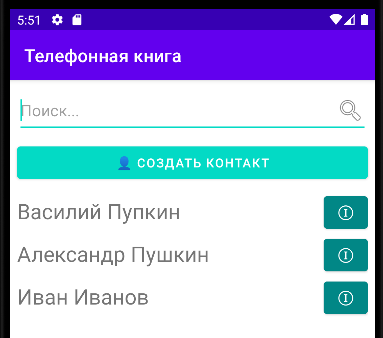
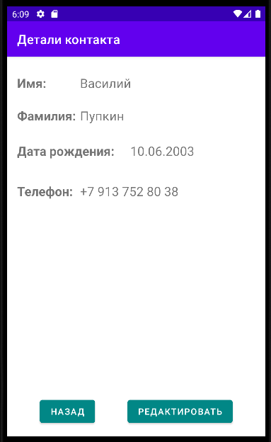
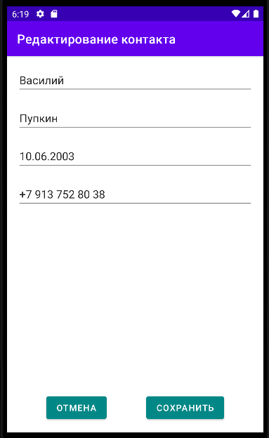

# Лабораторная
Реализовать приложение "Записная книжка" для хранения телефонов, даты рождения и другой информации о людях.

Готовое приложение закоммитить на github.com, прислать ссылку.

## Функциональные требования
* На начальном экране пользователь может просматривать список людей.
    * Над списком есть поле поиска, при вводе в которое список динамически обновляется
      (поиск по имени и фамилии).
    * Над списком кнопка "Создать контакт". При нажатии на неё пользователь попадает на экран редактирования/создания контакта.
    * Элементы списка содержат имя и фамилию и кнопку [ⓘ]. При нажатии на неё открывается экран просмотра контакта.

  
* Экран просмотра контакта отображает.
    * Имя.
    * Фамилия.
    * Номер телефона (при нажатии происходит вызов).
    * День рождения.
    * ...(добавить по желанию)
    * На этом же экране есть кнопки:
      * "редактировать", нажав на которую, пользователь
        попадает на экран редактирования.
      * "назад" - пользователь
        попадает на главный экран.
      * "удалить" - удаляет контакт после диалога подтверждения.

  
* Экран редактирования/создания контакта. Отредактированные данные можно сохранить либо отменить изменения.
  После этого пользователь попадает на главный экран (список обновляется).
  * При создании контакта открывается та же форма, только поля ввода пустые. 

  

## Этапы разработки
* Реализовать вывод списка (данные пока задаются статично) через RecyclerView.
* Реализовать переход на скрин с деталями при нажатии на кнопку [ⓘ].
* Реализовать переход на скрин редактирования.
* Реализовать запись и чтение в БД (SQLite).
* Реализовать вызов при клике на телефонный номер.
* Реализовать MVVM (по желанию).
* Реализовать сохранение на внешний сервер (по желанию).
