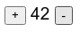
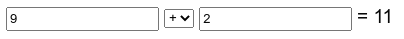
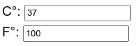
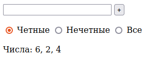

### Вопросы по курсу "Программирование мобильных устройств"

* Написать кликер с возможностью уменьшения и увеличения:

    
    
    Если число нечётное, то оно красное, иначе зелёное.

* Калькулятор площади прямоугольника:

  

  Площадь должна обновляться автоматически при изменении слайдеров (`addOnChangeListener`).

* Сделать обратный таймер:

  

  Таймер при нажатии кнопки "старт" идёт до 0 и останавливается. Можно остановить кнопкой "стоп".
  Пользоваться `CountDownTimer` нельзя, `Handler` и `Thread` можно.

* Сделать калькулятор:
  
  
 
  Ответ обновляется автоматически при изменении полей ввода (`addTextChangeListener`, `Spinner.setOnItemSelectedListener`).

* Сделать калькулятор перевода температур из Цельсия в Фаренгейты и обратно:

  

* Добавляем числа в `ArrayList<Integer>` и показываем среднее арифметическое:

  

* Добавляем числа в `ArrayList<Integer>` и показываем элементы списка в 
  зависимости от положения `RadioButton` (для реакции на изменения использовать
  `RadioGroup.setOnChangeListener`).

  

* При открытии приложение каждую секунду добавляет в TextView очередное простое число:

  2, 3, 5, 7, 11...

* Многострочное поле ввода, а снизу выводится список слов и сколько раз это слово встретилось.
  Обновляется автоматически при изменении поля.

  

* Калькулятор перевода в другие системы счисления (2, 8, 16). Результат меняется при изменении полей.
  
  
