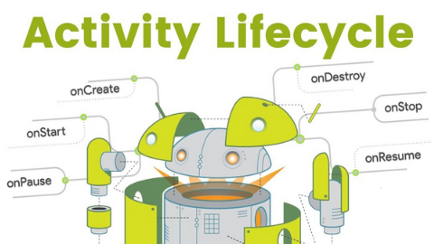
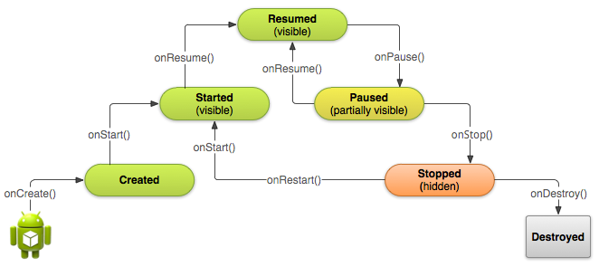
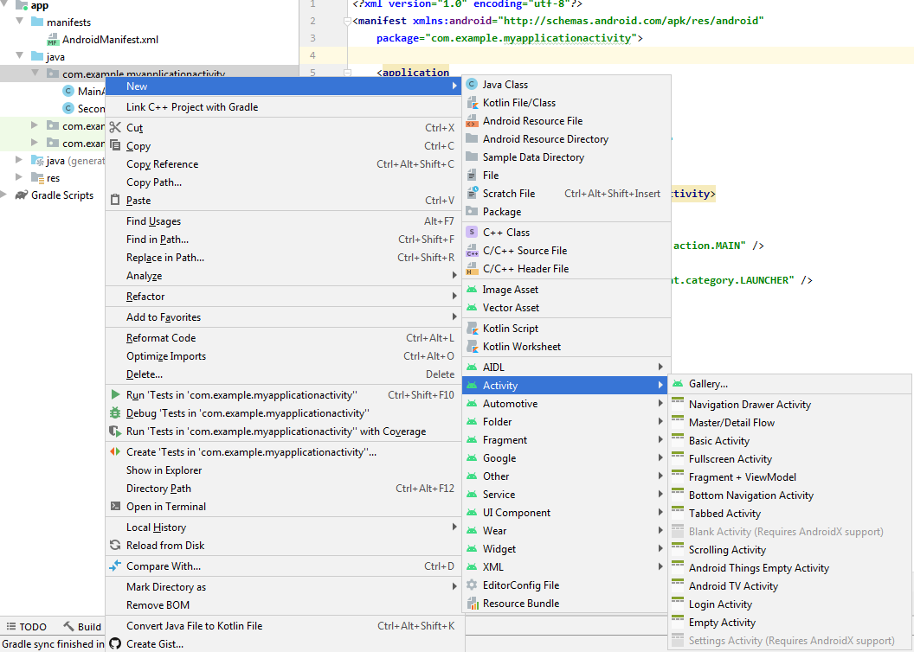
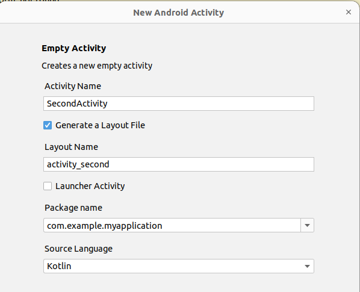

### Activity



[все лекции](https://github.com/dmitryweiner/android-lectures/blob/master/README.md)

[видео](https://youtu.be/dwP9QgfWdCE)
---

### Жизненный цикл

---

### Жизненный цикл
* onCreate - активити создана и готовится показаться.
* onStart - на экране, пока не обрабатывает события пользователя.
* onResume - обрабатывает события пользователя.
* onPause - ещё на экране, не обрабатывает события.
* onStop - остановлена, не видна.
* onDestroy - приложение закрыто.
---

```kotlin
class MainActivity : AppCompatActivity() {
    override fun onCreate(savedState: Bundle?) {
        Log.d(getString(R.string.app_name), "onCreate")
        super.onCreate(savedState)
        setContentView(R.layout.activity_main)
    }

    override fun onStart() {
        super.onStart()
        Log.d(getString(R.string.app_name), "onStart")
    }
    override fun onPause() {
        super.onPause()
        Log.d(getString(R.string.app_name), "onPause")
    }
    override fun onResume() {
        super.onResume()
        Log.d(getString(R.string.app_name), "onResume")
    }
    override fun onStop() {
        super.onStop()
        Log.d(getString(R.string.app_name), "onStop")
    }
    override fun onDestroy() {
        super.onDestroy()
        Log.d(getString(R.string.app_name), "onDestroy")
    }
}
```
---

### Сохранение состояния в bundle
* При повороте устройства, закрытии приложения все введённые пользователем данные пропадают.
* Чтобы так не было, необходимо сохранять текущее состояние активити в bundle.
* Для этого применяются 2 метода:
  * `onSaveInstanceState` - вызывается системой, когда приложение готово свернуться.
  * `onCreate(savedInstanceState: Bundle?)` - когда приложение разворачивается.

---
### Сохранение состояния в bundle
```kotlin
val EDIT_TEXT_KEY = "EDIT_TEXT"

override fun onSaveInstanceState(outState: Bundle) {
    val editText = findViewById<EditText>(R.id.editText)
    outState.putString(EDIT_TEXT_KEY, editText.text.toString())
    super.onSaveInstanceState(outState)
}
```
---

### Как это работает:
* Сохраняется пара ключ-значение:

```kotlin
outState.putString(
  "ключ", // любой текстовый ключ
  "значение"
)
```
* Восстанавливается значение по ключу:

```kotlin
сохранённое значение = savedState.getString("ключ")
```
---

### Тип сохраняемого значения
* Сохранять можно не только строки, но и другие разнообразные типы:
  * putBoolean - getBoolean
  * putInt - getInt
  * putIntArray - getIntArray
  * и т.д.
---

### Восстановление состояния из bundle
```kotlin
val EDIT_TEXT_KEY = "EDIT_TEXT"

override fun onCreate(savedInstanceState: Bundle?) {
    super.onCreate(savedInstanceState)
    setContentView(R.layout.activity_main)
    
    if (savedInstanceState != null) {
        val editText = findViewById<EditText>(R.id.editText)
        editText.setText(savedInstanceState.getString(EDIT_TEXT_KEY))
    }
}
```
---

### Всё в сборе
```kotlin
class MainActivity : AppCompatActivity() {

  val EDIT_TEXT_KEY = "EDIT_TEXT"
  
  override fun onCreate(savedInstanceState: Bundle?) {
      super.onCreate(savedInstanceState)
      setContentView(R.layout.activity_main)
      
      if (savedInstanceState != null) {
          val editText = findViewById<EditText>(R.id.editText)
          editText.setText(savedInstanceState.getString(EDIT_TEXT_KEY))
      }
  }
  
  override fun onSaveInstanceState(outState: Bundle) {
      val editText = findViewById<EditText>(R.id.editText)
      outState.putString(EDIT_TEXT_KEY, editText.text.toString())
      super.onSaveInstanceState(outState)
  }
}
```
---

### Сохраняем в State
* Если параметров больше 2, разумнее завести под это отдельный класс и сохранять в него.
* Создаём Serializable класс внутри Activity:
```kotlin
lateinit var state: State
class State(
    var text: String, // эти значения для примера
    var counter: Int, // у вас могут быть любые
    var flag: Boolean
): Serializable
```
---

### Сохранение данных стейта
```kotlin
val STATE_KEY = "STATE"

override fun onSaveInstanceState(outState: Bundle) {
    super.onSaveInstanceState(outState)
    
    val editText = findViewById<EditText>(R.id.editText)
    
    // сохраняем текущие значения в state
    state.text = editText.text
    state.counter = // ...
    
    outState.putSerializable(STATE_KEY, state)
}
```
---

### Восстановление данных стейта
```kotlin
val STATE_KEY = "STATE"

override fun onCreate(savedInstanceState: Bundle?) {
    super.onCreate(savedInstanceState)
    setContentView(R.layout.activity_main)

    state = if (savedInstanceState != null)
        // если есть сохранённое состояние, восстанавливаем его
        savedInstanceState.getSerializable(STATE_KEY) as State
    else
        // иначе устанавливаем дефолтные значения
        State(
            text = "",
            counter = 0,
            flag = false
        )
    renderState()
}

fun renderState() {
    val editText = findViewById<EditText>(R.id.editText)
    editText.setText(state.text)
}
```
---

### Всё в сборе
```kotlin
class MainActivity : AppCompatActivity() {
    val STATE_KEY = "STATE"

    lateinit var state: State
    class State(
        var counter: Int,
    ): Serializable

    override fun onCreate(savedInstanceState: Bundle?) {
        super.onCreate(savedInstanceState)
        setContentView(R.layout.activity_main)

        state = if (savedInstanceState != null)
            savedInstanceState.getSerializable(STATE_KEY) as State
        else
            State(counter = 0)

        val buttonPlus = findViewById<Button>(R.id.buttonPlus)
        buttonPlus.setOnClickListener {
            state.counter += 1
            renderState()
        }
        val buttonMinus = findViewById<Button>(R.id.buttonMinus)
        buttonMinus.setOnClickListener {
            state.counter -= 1
            renderState()
        }

        renderState()
    }

    override fun onSaveInstanceState(outState: Bundle) {
        super.onSaveInstanceState(outState)
        outState.putSerializable(STATE_KEY, state)
    }

    fun renderState() {
        val textView = findViewById<TextView>(R.id.textViewCounter)
        textView.text = state.counter.toString()
    }
}
```
---

### Переход на другую активити
* Для начала надо создать другую активити (Empty Activity).
* [Подробнее](https://www.fandroid.info/urok-5-kotlin-dobavlenie-vtorogo-ekrana-v-android-prilozhenie/).



---
Имя можно выбрать исходя из назначения активити:


---
### Переход на другую активити
```kotlin
class MainActivity : AppCompatActivity() {
    override fun onCreate(savedInstanceState: Bundle?) {
        super.onCreate(savedInstanceState)
        setContentView(R.layout.activity_main)
        val button = findViewById<Button>(R.id.button)
        button.setOnClickListener {
            val intent = Intent(this, SecondActivity::class.java)
            startActivity(intent)
        }
    }
}
```
---
### Передача параметров
```kotlin
class MainActivity : AppCompatActivity() {
    companion object {
        const val EXTRA_KEY = "EXTRA"
    }
    override fun onCreate(savedInstanceState: Bundle?) {
        super.onCreate(savedInstanceState)
        setContentView(R.layout.activity_main)
        val button = findViewById<Button>(R.id.button)
        button.setOnClickListener {
            val intent = Intent(this, SecondActivity::class.java)
            intent.putExtra(EXTRA_KEY, "тут какая-то строка")
            startActivity(intent)
        }
    }
}
```
---
### Приём параметров в вызванной активити
[Подробнее](https://startandroid.ru/ru/uroki/vse-uroki-spiskom/67-urok-28-extras-peredaem-dannye-s-pomoschju-intent.html)

```kotlin
class SecondActivity : AppCompatActivity() {
    override fun onCreate(savedInstanceState: Bundle?) {
        super.onCreate(savedInstanceState)
        setContentView(R.layout.activity_second)

        // val intent = getIntent()
        val s = intent.getStringExtra(MainActivity.EXTRA_KEY)
        
        val textView = findViewById<TextView>(R.id.textView)
        textView.text = s
    }
}
```
---

### Приём параметров в зависимости от типа
* Тип переданных параметров должен совпадать.
* Передали строку:
```kotlin
// MainActivity
intent.putExtra(EXTRA_KEY, "тут какая-то строка")
// SecondActivity
val s = intent.getStringExtra(MainActivity.EXTRA_KEY)
```
* Передали число:
```kotlin
// MainActivity
intent.putExtra(EXTRA_KEY, 123)
// SecondActivity
val n = intent.getIntExtra(MainActivity.EXTRA_KEY, 0)
```
---

### Получение ответа от вызванной Activity
* Допустим, MainActivity вызывает SecondActivity и ожидает от пользователя некоего ответа. Например, если это редактирование, можно либо сохранить результат, либо отменить.
* Чтобы получить ответ, надо вызвать интент через `startActivityForResult`.
* Для получения ответа надо реализовать метод `onActivityResult`. 
* [Подробнее](https://startandroid.ru/ru/uroki/vse-uroki-spiskom/68-urok-29-vyzyvaem-activity-i-poluchaem-rezultat-metod-startactivityforresult.html),
  [ещё](https://startandroid.ru/ru/uroki/vse-uroki-spiskom/69-urok-30-podrobnee-pro-onactivityresult-zachem-nuzhny-requestcode-i-resultcode.html).
---

### Вызов через `startActivityForResult`

```kotlin
class MainActivity : AppCompatActivity() {
    val REQUEST_CODE = 1
    
    override fun onCreate(savedInstanceState: Bundle?) {
        // ...
        val button = findViewById<Button>(R.id.button)
        button.setOnClickListener {
          val intent = Intent(this, SecondActivity::class.java)
          startActivityForResult(intent, REQUEST_CODE)
        }
    }
}
```
---

### Отправка результата из SecondActivity
```kotlin
class SecondActivity : AppCompatActivity() {
    companion object {
        const val RESULT_KEY = "result"
    }
    override fun onCreate(savedInstanceState: Bundle?) {
        super.onCreate(savedInstanceState)
        setContentView(R.layout.activity_main)
        val button = findViewById<Button>(R.id.button)
        button.setOnClickListener {
            val returnIntent = Intent()
            returnIntent.putExtra(RESULT_KEY, "тут какой-то результат (строка)")
            setResult(Activity.RESULT_OK, returnIntent)
            finish()
        }
    }
}
```
---

### Получение результата вызова в MainActivity

```kotlin
override fun onActivityResult(requestCode: Int, resultCode: Int, data: Intent?) {
    super.onActivityResult(requestCode, resultCode, data)

    if (requestCode == REQUEST_CODE && resultCode == Activity.RESULT_OK) {
        // получение данных от Activity2
        val result = data?.getStringExtra(SecondActivity.RESULT_KEY) 
        // в result лежит строка "тут какой-то результат (строка)"
    }
}
```
---

### Задачи
* Написать кликер с <button>+</button> и <button>-</button>. Сделать так, чтобы он не сбрасывался при повороте экрана.


* Три кнопки открывают одну и ту же Activity. На какую кнопку нажали, та цифра в Activity и показывается:

<button>1</button>
<button>2</button>
<button>3</button>
---

### Задачи
* Список чисел [RecyclerView](https://dmitryweiner.github.io/android-lectures/Recycler-view.html#/) с возможностью добавления числа:
<br/><input><button>+</button><br/>
<ul style="width: 200px; height: 150px; overflow-y: scroll"><li>1 <button>➡</button></li><li>3 <button>➡</button></li><li>15 <button>➡</button></li><li>22 <button>➡</button></li><li>14 <button>➡</button></li><li>47 <button>➡</button></li><li>2 <button>➡</button></li></ul>
При нажатии на [+] в список добавляется очередное число из поля ввода.
При клике на [➡] на элементе списка происходит переход на другую активити, где отображается выбранное число.
При повороте устройства введённые числа сохраняются.
---

### Задачи
https://developer.android.com/codelabs/basic-android-kotlin-training-activities-intents
---

### Полезные ссылки
* https://developer.alexanderklimov.ru/android/theory/lifecycle.php
* https://metanit.com/java/android/2.1.php
* https://www.digitalocean.com/community/tutorials/android-intent-handling-between-activities-using-kotlin
* https://www.fandroid.info/urok-5-kotlin-dobavlenie-vtorogo-ekrana-v-android-prilozhenie/
* https://startandroid.ru/ru/uroki/vse-uroki-spiskom/67-urok-28-extras-peredaem-dannye-s-pomoschju-intent.html
---

### Полезные ссылки
<iframe width="560" height="315" src="https://www.youtube.com/embed/njmOeFadDEI" title="YouTube video player" frameborder="0" allow="accelerometer; autoplay; clipboard-write; encrypted-media; gyroscope; picture-in-picture" allowfullscreen></iframe>
---

### Полезные ссылки
<iframe width="560" height="315" src="https://www.youtube.com/embed/puj9OXs2iPM" title="YouTube video player" frameborder="0" allow="accelerometer; autoplay; clipboard-write; encrypted-media; gyroscope; picture-in-picture" allowfullscreen></iframe>
