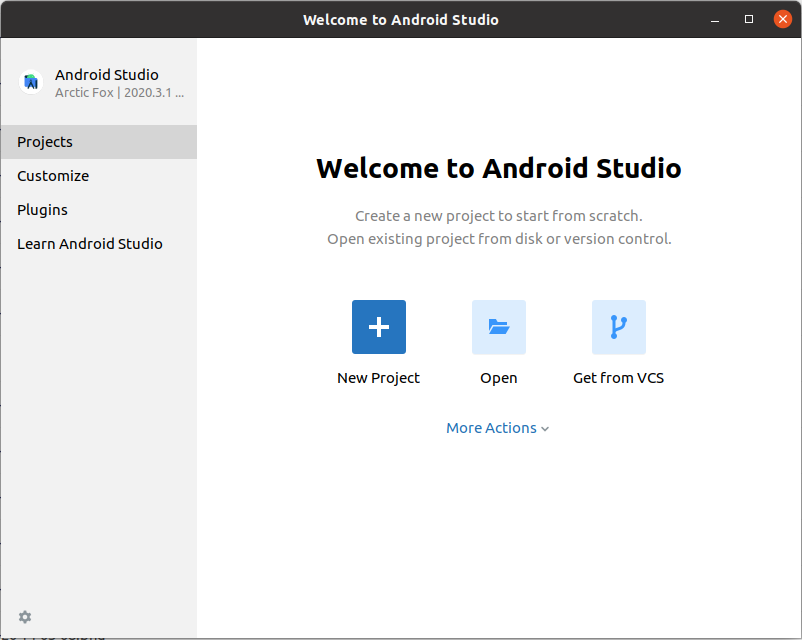
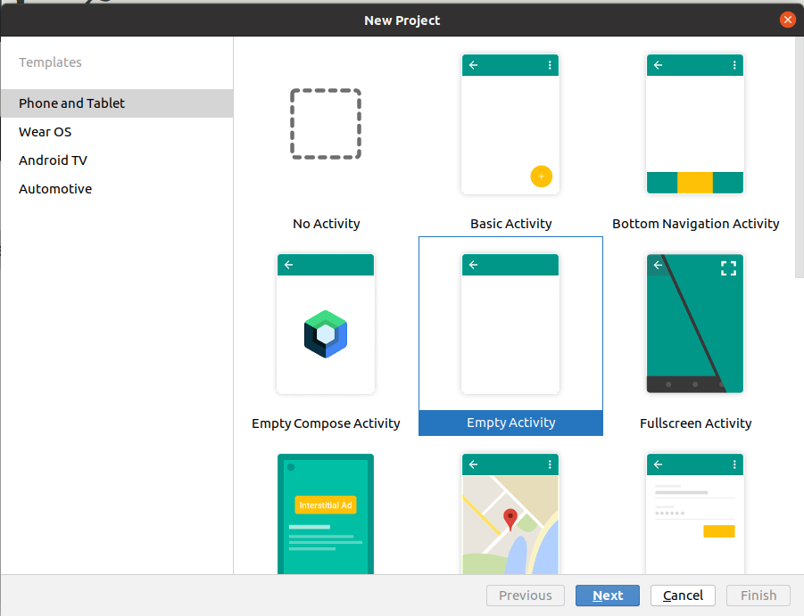
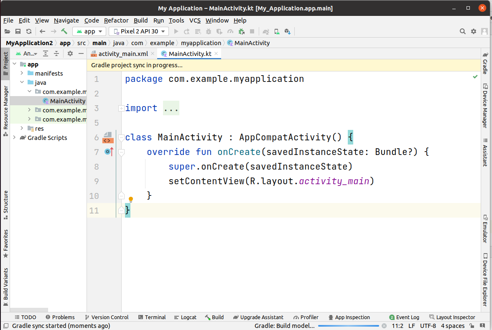
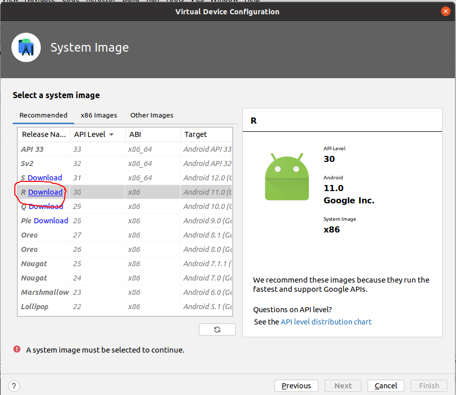
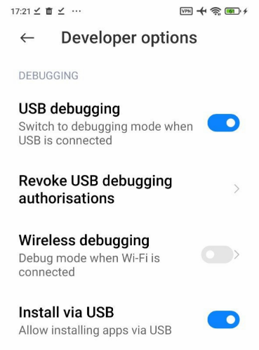
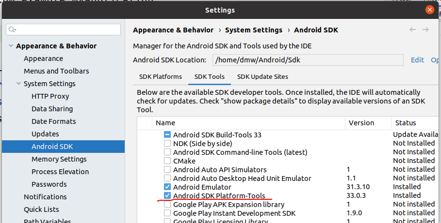
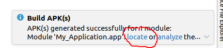
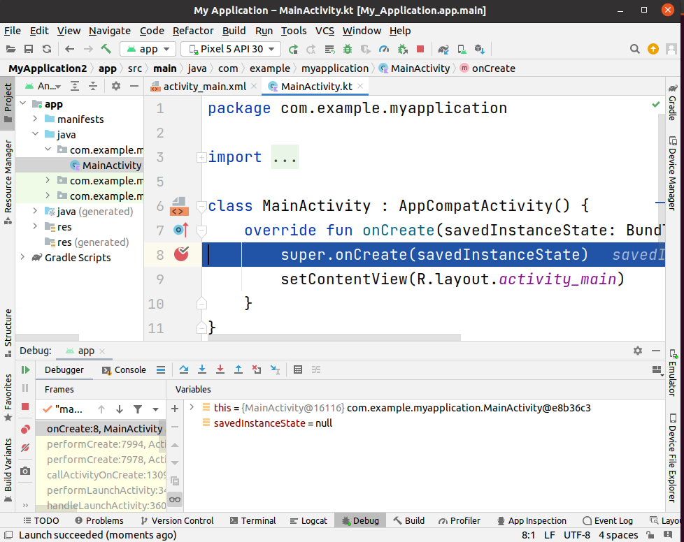
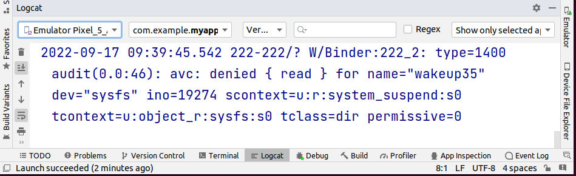

### Android Studio


[все лекции](https://github.com/dmitryweiner/android-lectures/blob/master/README.md)

[видео]()
---

### Где скачать?
* [Качать здесь](https://developer.android.com/studio#downloads).
* Доступные операционные системы:
  * Linux
  * Windows
  * MacOS
---
  
### Запуск

---

### Начальный экран

---

### Выбор типа приложения

---

### Выбор языка

---

### Свежесозданное приложение

---

### Настройка эмулятора
* Tools -> Device manager -> Create device


---

### Настройка эмулятора
* Надо скачать эмулятор ОС. Рекомендую Android 11 (API 30):


---

### Подключение телефона по USB
* Войти в "Developer options" в настройках. Для разных оболочек это делается по-разному,
обычно [множественными кликами на версию билда в настройках](https://www.digitaltrends.com/mobile/how-to-get-developer-options-on-android/).
* В Developer options выбрать следующие опции:
  * USB debugging.
  * Install via USB.
---
  


---

### Компиляция в `*.APK`
* Чтобы работала компиляция в APK, что может понадобиться для публикации приложения,
необходимо поставить следующие пакеты.
* Tools -> SDK Manager -> вкладка SDK Tools:
  * Android SDK Platform Tools
---


---

### Где лежит APK?

---

### Debug
* При нажатии на 🪲 попадаем в режим дебага.
* Дебаггер останавливается на точках останова (красная точка слева от кода).
* Можно смотреть значения переменных.
---


---

### Логи
* Во время работы приложение может [писать в логи](https://developer.android.com/reference/android/util/Log)
  с помощью конструкции:
```kotlin
private val APP_TAG = "MyActivity";
Log.d(APP_TAG, "Я написал в логи!")
```
* `.d` уровень логгирования DEBUG, бывают:
```kotlin
    public static final int ASSERT = 7;
    public static final int DEBUG = 3;
    public static final int ERROR = 6;
    public static final int INFO = 4;
    public static final int VERBOSE = 2;
    public static final int WARN = 5;
```
* По ним можно фильтровать.
---

### Логи

---

### Полезные ссылки
* https://developer.android.com/studio/intro