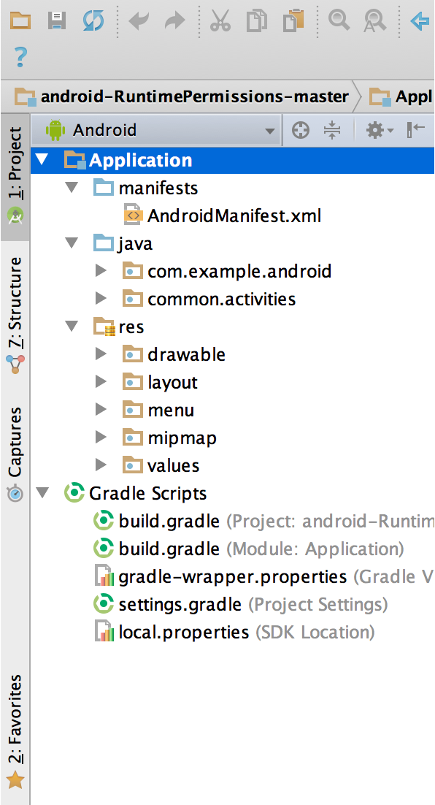

### Анатомия приложения

[все лекции](https://github.com/dmitryweiner/android-lectures/blob/master/README.md)

[видео]()
---

---
    * Конфиги: Manifest.xml, gradle.
    * Код.
    * Разметка.
    * Строки.
    * Картинки, видео.
    * Тесты.