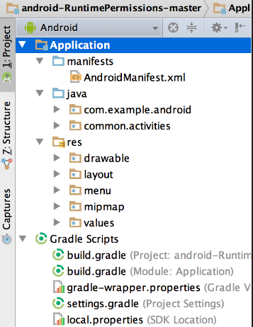

### Анатомия приложения


[все лекции](https://github.com/dmitryweiner/android-lectures/blob/master/README.md), [видео](https://youtu.be/iuZPXyOTI1s)
---

#### Приложение компилируется в 
  [байткод](https://ru.wikipedia.org/wiki/%D0%91%D0%B0%D0%B9%D1%82-%D0%BA%D0%BE%D0%B4)
  и выполняется на [JVM](https://ru.wikipedia.org/wiki/Java_Virtual_Machine):


---

### Жизнь APK


[подробнее](https://medium.com/android-news/virtual-machine-in-android-everything-you-need-to-know-9ec695f7313b)
---

### Структура приложения

---
    
### Конфиги
* В AndroidManifest.xml задаются:
  * Название приложения и пакета.
  * Иконка приложения и подпись под ней.
  * Разрешения приложения.
  * Экраны.
* В build.gradle:
  * Инструкции для сборки.
  * Зависимости от сторонних библиотек.
  * [Подробнее про Gradle](https://developer.alexanderklimov.ru/android/theory/gradle.php).
---

### Манифест
* [Документация](https://developer.android.com/guide/topics/manifest/manifest-intro), [RU](http://developer.alexanderklimov.ru/android/theory/AndroidManifestXML.php).
* Примерное содержание:

```xml
<?xml version="1.0" encoding="utf-8"?>
<manifest xmlns:android="http://schemas.android.com/apk/res/android"
    package="com.example.myapplication">

    <application
        android:allowBackup="true"
        android:icon="@mipmap/ic_launcher"
        android:label="@string/app_name"
        android:roundIcon="@mipmap/ic_launcher_round"
        android:supportsRtl="true"
        android:theme="@style/Theme.MyApplication">
        <activity
            android:name=".MainActivity"
            android:exported="true">
            <intent-filter>
                <action android:name="android.intent.action.MAIN" />

                <category android:name="android.intent.category.LAUNCHER" />
            </intent-filter>
        </activity>
    </application>

</manifest>
```
---

### Код
* Код лежит в `java/%PACKAGE_NAME%`:

* Код может быть как на Java, так и на Kotlin.
* Лучше разбивать его на классы и модули для улучшения читаемости.
---

### Код
```kotlin
package com.example.myapplication

import androidx.appcompat.app.AppCompatActivity
import android.os.Bundle
import android.util.Log

class MainActivity : AppCompatActivity() {
    override fun onCreate(savedInstanceState: Bundle?) {
        super.onCreate(savedInstanceState)
        setContentView(R.layout.activity_main)
    }
}
```
---

### Ресурсы
* Ресурсы лежат в `res`:


* [Подробнее](https://developer.android.com/guide/topics/resources/providing-resources), [RU](https://developer.alexanderklimov.ru/android/theory/resources.php).
---

### Виды ресурсов
* Разметка экрана:
  * Активити.
  * Фрагменты.
* Картинки.
* Видео.
* Значения:
  * Строки.
  * Цвета.
---
### Разметка экрана
* Разметка лежит в `res/layout`:


* Примерное содержимое:

```xml
<?xml version="1.0" encoding="utf-8"?>
<androidx.constraintlayout.widget.ConstraintLayout xmlns:android="http://schemas.android.com/apk/res/android"
    xmlns:app="http://schemas.android.com/apk/res-auto"
    xmlns:tools="http://schemas.android.com/tools"
    android:layout_width="match_parent"
    android:layout_height="match_parent"
    tools:context=".MainActivity">

    <TextView
        android:layout_width="wrap_content"
        android:layout_height="wrap_content"
        android:text="Hello World!"
        app:layout_constraintBottom_toBottomOf="parent"
        app:layout_constraintLeft_toLeftOf="parent"
        app:layout_constraintRight_toRightOf="parent"
        app:layout_constraintTop_toTopOf="parent" />

</androidx.constraintlayout.widget.ConstraintLayout>
```
---

### Визуальный редактор интерфейса
* Можно проектировать интерфейс мышью, переключившись в режим `Design`:


---

### Строковые ресурсы, константы
* Лежат тут:


* Содержимое:
```xml
<resources>
    <string name="app_name">My Application</string>
</resources>
```
---

### Доступ к ресурсам в коде
* Ко всем ресурсам можно получить доступ в коде через конструкцию `R.%ТИП_РЕСУРСА%.%ИМЯ_РЕСУРСА%`.

```kotlin
// доступ к разметке экрана
R.layout.activity_main

// доступ к кнопке по ID
R.id.button

// чтение содержимого строки
R.string.app_name
// или так
val s = resources.getText(R.string.app_name)
```
---

### Доступ к строковым ресурсам
```xml
<string name="earth">Earth</string>
<string name="moon">Moon</string>
<string-array name="system">
    <item>@string/earth</item>
    <item>@string/moon</item>
</string-array>
```

```kotlin
val s = resources.getText(R.string.earth)
println(s) // Earth

val arr = resources..getStringArray(R.string.system)
println(arr.joinToString(", ")) // Earth, Moon
```
---

### Тесты
* Android Studio умеет запускать (и генерирует некие начальные) тесты:
  * [Юнит-тесты](https://ru.wikipedia.org/wiki/%D0%9C%D0%BE%D0%B4%D1%83%D0%BB%D1%8C%D0%BD%D0%BE%D0%B5_%D1%82%D0%B5%D1%81%D1%82%D0%B8%D1%80%D0%BE%D0%B2%D0%B0%D0%BD%D0%B8%D0%B5).
  * [Интеграционные тесты](https://ru.wikipedia.org/wiki/%D0%98%D0%BD%D1%82%D0%B5%D0%B3%D1%80%D0%B0%D1%86%D0%B8%D0%BE%D0%BD%D0%BD%D0%BE%D0%B5_%D1%82%D0%B5%D1%81%D1%82%D0%B8%D1%80%D0%BE%D0%B2%D0%B0%D0%BD%D0%B8%D0%B5).


---

### Пример юнит-тестов
```kotlin
fun revert(n: Int): Int {
    val sign = n >= 0
    val absN = Math.abs(n)
    val reverted = absN.toString().reversed().toInt()
    return if (sign)  reverted else -reverted
}

class ExampleUnitTest {
    @Test
    fun revert_simple() {
        assertEquals(321, revert(123))
    }
    @Test
    fun revert_withNulls() {
        assertEquals(321, revert(1230000))
    }
    @Test
    fun revert_minus() {
        assertEquals(-321, revert(-123))
    }
}
```
---

### Задача
* Разработать кликер с возможностью уменьшения и увеличения числа. 
При уменьшении числа значение не должно уходить в минус.


---

### Полезные ссылки
* https://developer.alexanderklimov.ru/android/theory/
* https://developer.android.com/guide
* <iframe width="560" height="315" src="https://www.youtube.com/embed/h3ylwK6MINI" title="YouTube video player" frameborder="0" allow="accelerometer; autoplay; clipboard-write; encrypted-media; gyroscope; picture-in-picture" allowfullscreen></iframe>