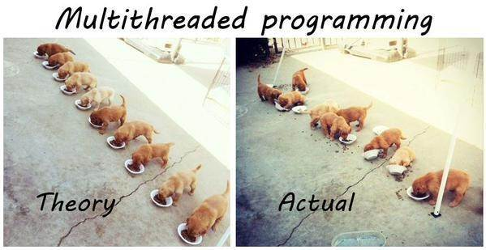
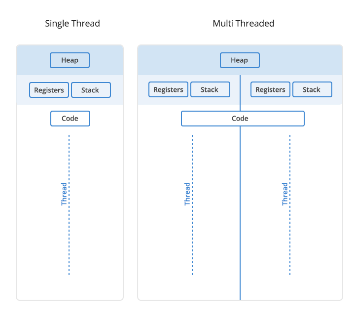
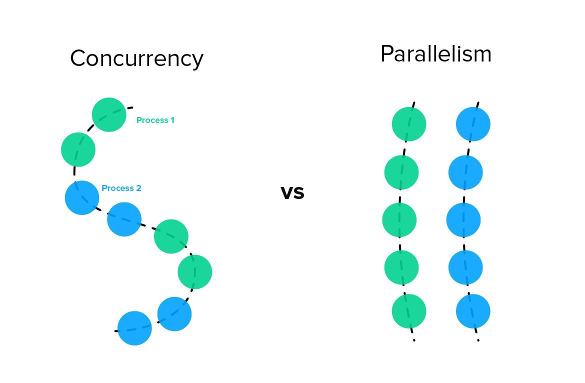
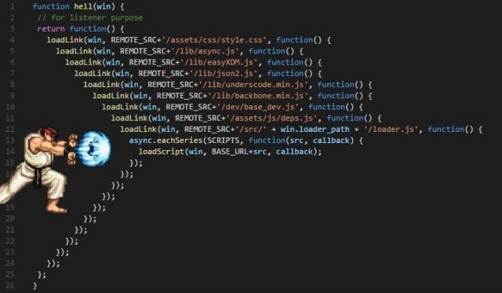
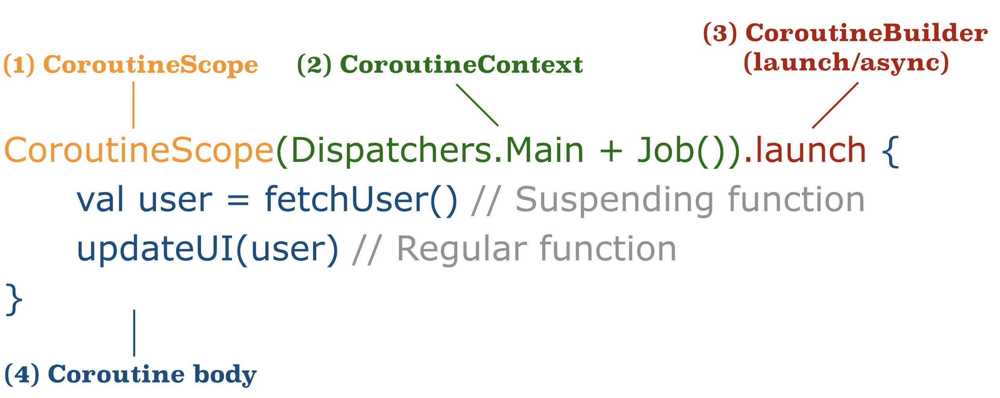
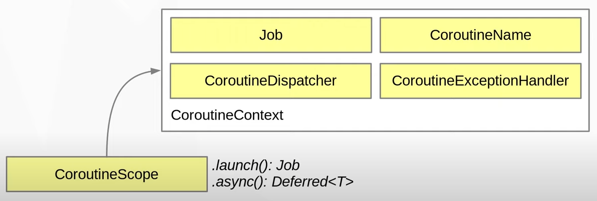
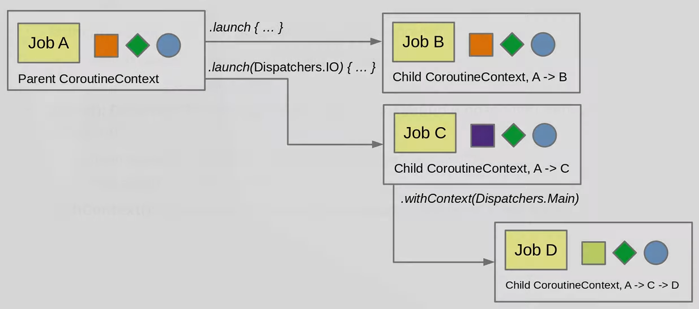
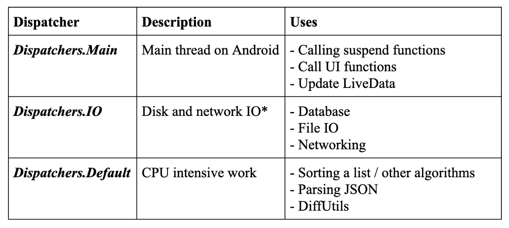

## Асинхронный код



[все лекции](https://github.com/dmitryweiner/android-lectures/blob/master/README.md)

[видео]()
---


---

### Потоки
* Создание:
```kotlin
thread {
    // тут код, выполняющийся в другом потоке
}
```
* Запуск:
```kotlin
val myThread = thread(start = false) {
    // ..
}
myThread.start()
```
* Остановка:
```kotlin
thread?.interrupt() // поток должен слушать InterruptedException
```
---

### Общение между потоками через Handler
[Подробнее](https://developer.alexanderklimov.ru/android/theory/handler.php)

```kotlin
class MainActivity : AppCompatActivity() {
    private var mHandler: Handler? = null
    var gameOn = false
    var startTime: Long = 0

    override fun onCreate(savedInstanceState: Bundle?) {
        super.onCreate(savedInstanceState)
        setContentView(R.layout.activity_main)

        startTime = System.currentTimeMillis()
        mHandler = object : Handler(Looper.getMainLooper()) {
            override fun handleMessage(msg: Message) {
                super.handleMessage(msg)
                if (gameOn) {
                    val seconds = (System.currentTimeMillis() - startTime) / 1000
                    Log.i("info", "seconds = $seconds")
                }
                mHandler!!.sendEmptyMessageDelayed(0, 1000)
            }
        }

        gameOn = true
        (mHandler as Handler).sendEmptyMessage(0)
    }
}
```
---

### Обновление UI
* Нельзя трогать интерфейс не из главного UI-потока. 
* Для этого используется конструкция `runOnUiThread`:
```kotlin
runOnUiThread {
    // обращение к UI
    textView.text = i.toString()
}
```
---

### Пример таймера с остановом
```kotlin
val textView = findViewById<TextView>(R.id.textView)

var thread: Thread? = null
var i = 0

val buttonStart = findViewById<Button>(R.id.buttonStart)
val buttonStop = findViewById<Button>(R.id.buttonStop)

buttonStart.setOnClickListener {
    thread = thread {
        while (true) {
            try {
                Thread.sleep(1000)
            } catch (e: InterruptedException) {
                // We've been interrupted: no more messages.
                return@thread
            }
            runOnUiThread {
                textView.text = i.toString()
            }
            i++
        }
    }
}

buttonStop.setOnClickListener {
    thread?.interrupt()
}
```
---

### Корутина
> Coroutine (корутины), или сопрограммы — это блоки кода, которые работают по очереди. В нужный момент исполнение такого блока приостанавливается с сохранением всех его свойств, чтобы запустился другой код. Когда управление возвращается к первому блоку, он продолжает работу. В результате программа выполняет несколько функций одновременно.
---

### Разница корутин и потоков

---

### Плюсы и минусы корутин
* Плюсы:
  * Корутины легче потоков (тратят меньше ресурсов).
  * Асинхронный код пишется в линейном виде без callback hell.
* Минусы:
  * Выполнение идёт не параллельно, а последовательно (быстрее не будет).
  * Сложнее для программиста.
----
  

---

### Корутины: установка
* build.gradle (Module):

```
dependencies {
    // ...
    implementation 'org.jetbrains.kotlinx:kotlinx-coroutines:1.3.9'
    implementation 'org.jetbrains.kotlinx:kotlinx-coroutines-android:1.6.1'
    implementation 'androidx.lifecycle:lifecycle-runtime-ktx:2.5.1'
}
```
---

### Scope, context, dispatcher


---

### Scope, context, dispatcher
* Корутина выполняется в определённой области видимости (scope), определяющей:
    * Контекст - хранит диспетчер и другие настройки корутины.
    * Диспетчер - определяет, какой поток используется для выполнения.
    * И другие параметры.
* [Подробнее](https://kotlinlang.ru/docs/coroutine-context-and-dispatchers.html).
---


---

### Готовые области видимости
* `GlobalScope` - корутины выполняются всё время жизни программы, требуют повышенного внимания. **Не использовать.**
* `MainScope` - выполняется в главном UI-потоке приложения.
* `CoroutineScope(_тут указан диспетчер_)` - выполняется в указанном потоке.
* `LifecycleScope` - выполняется во время жизни Activity. Наш выбор!👍
---

В процессе запуска корутин можно задавать диспетчер, отличающийся от диспетчера, лежащего в контексте корутины:

---

### Виды диспетчеров


---

### Варианты запуска корутин
* Запуск и пошли дальше:
```kotlin
launch {
    // тут асинхронный код
}
```
* Запуск с переопределением диспетчера:
```kotlin
launch(Dispatchers.IO) {
    // тут операции ввода-вывода
}
```
---

### Варианты запуска корутин
* Запуск и ожидание результата (вызывающий поток стоит):
```kotlin
withContext(Dispatchers.Main) {
    // тут асинхронный код
}
```
* Запуск с получением результата. Вызывающий поток выполняется параллельно, пока не вызовет `await`.
```kotlin
val job = async {
    val response = fetchData() // пошли в интернет
    response
}
val result = job.await() // дождались результата
```
---

### Suspend функции
Функция, отмеченная suspend, может быть запущена только в контексте корутины:

```kotlin
suspend fun doDelay(n: Int) {
  delay(n * 1000)
}

launch {
    doDelay(5) // ждём 5 секунд
}
```
---

### Отмена выполнения корутины
* .cancelAndJoin() - снаружи корутины:
```kotlin
val job = launch {
    repeat(1000) { i ->
        println("job: I'm sleeping $i ...")
        delay(500L)
    }
}
delay(1300L) // delay a bit
println("main: I'm tired of waiting!")
job.cancelAndJoin() // cancels the job
```
* [Подробнее](https://kotlinlang.ru/docs/cancellation-and-timeouts.html).
---

### Отмена выполнения корутины
* Проверка `isActive` в самой корутине:
```kotlin
val startTime = System.currentTimeMillis()
val job = launch(Dispatchers.Default) {
    var nextPrintTime = startTime
    var i = 0
    while (isActive) { // cancellable computation loop
        // print a message twice a second
        if (System.currentTimeMillis() >= nextPrintTime) {
            println("job: I'm sleeping ${i++} ...")
            nextPrintTime += 500L
        }
    }
}
delay(1300L) // delay a bit
println("main: I'm tired of waiting!")
job.cancelAndJoin() // cancels the job and waits for its completion
println("main: Now I can quit.")
```
* [Подробнее](https://kotlinlang.ru/docs/cancellation-and-timeouts.html).
---

### Отмена по таймауту
```kotlin
withTimeout(1300L) {
    repeat(1000) { i ->
        println("I'm sleeping $i ...")
        delay(500L)
    }
}
```
---

### Родительские права
* Родительская корутина не завершится, пока не закончатся вложенные корутины.
* Если во вложенной корутине происходит исключение, отменяется и родительская.
* Если родительская корутина завершается принудительно, аварийно завершаются и все вложенные.
* Кроме случая, когда в контекст передан другой Job (или корутина запущена в другом контексте:
```kotlin
withContext(Job()) {
    // корутина будет выполнятся дальше несмотря на прекращение родительской
}
```
---


### Пример: таймер с остановом на корутинах

```kotlin
val textView = findViewById<TextView>(R.id.textView)
val buttonStart = findViewById<Button>(R.id.buttonStart)
val buttonStop = findViewById<Button>(R.id.buttonStop)

buttonStart.setOnClickListener {
    isRunning = true
    lifecycleScope.launch {
        var i = 0
        while (isRunning) {
            delay(1000)
            i++
        }
    }
}

buttonStop.setOnClickListener {
    isRunning = false
}
```
---

### Функция считает N-ое простое число
```kotlin
fun isPrime(n: Int): Boolean {
    for(i in 2 until n) {
        if (n % i == 0) {
            return false
        }
    }
    return true
}

suspend fun getPrime(n: Int): Int {
    var currentNumber = 1
    var currentPrime = currentNumber
    var primeCounter = 0
    do {
        if (isPrime(currentNumber)) {
            currentPrime = currentNumber
            primeCounter++
        }
        currentNumber++
    } while (primeCounter < n)
    return currentPrime
}

// в onClick:
lifecycleScope.launch(Dispatchers.Default) {
    repeat(10_000) {
        val prime = getPrime(it).toString()
        withContext(Dispatchers.Main) {
            textView.text = prime.toString()
        }
        delay(10)
    }
}
```
---

### Задачи
* Сделать обратный таймер с кнопками "старт" и "стоп". При нажатии на "старт" идёт от 10 до 0 и останавливается.
При нажатии на "стоп" просто останавливается, можно возобновить подсчёт с помощью "старт".
---

### Полезные ссылки
* https://metanit.com/kotlin/tutorial/8.1.php
* https://kotlinlang.org/docs/coroutines-guide.html
* https://developer.android.com/kotlin/coroutines
* https://developer.android.com/topic/libraries/architecture/coroutines
* https://itzone.com.vn/en/article/kotlin-coroutines-in-android/

---

<iframe width="560" height="315" src="https://www.youtube.com/embed/_IjPVHRZbDU" title="YouTube video player" frameborder="0" allow="accelerometer; autoplay; clipboard-write; encrypted-media; gyroscope; picture-in-picture" allowfullscreen></iframe>
---

<iframe width="560" height="315" src="https://www.youtube.com/embed/b4mBmi1QNF0" title="YouTube video player" frameborder="0" allow="accelerometer; autoplay; clipboard-write; encrypted-media; gyroscope; picture-in-picture" allowfullscreen></iframe>
---

<iframe width="560" height="315" src="https://www.youtube.com/embed/er8dPeR8v3A" title="YouTube video player" frameborder="0" allow="accelerometer; autoplay; clipboard-write; encrypted-media; gyroscope; picture-in-picture" allowfullscreen></iframe>
