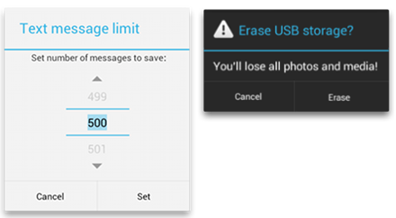
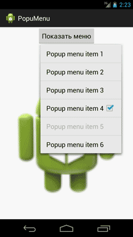

### Тосты, диалоги, всплывающие меню

[все лекции](https://github.com/dmitryweiner/android-lectures/blob/master/README.md)
---

### Тосты

* Используется, чтобы показать пользователю сообщение поверх текущего экрана.
* Как вызывать:
```kotlin
val toast = Toast.makeText(
    applicationContext, // контекст 
    "Ура, я тост!",     // текст тоста
    Toast.LENGTH_SHORT  // длительность показа
)
toast.show()
```
---

### Тосты
* У тостов можно настраивать место [появления, вид](https://developer.alexanderklimov.ru/android/toast.php):
* Расположение:
```kotlin
// по центру 
toast.setGravity(Gravity.CENTER, 0, 0);

// слева сверху
toast.setGravity(Gravity.TOP or Gravity.LEFT, 0, 0) 
```
---

### Диалог


[Подробнее](http://developer.alexanderklimov.ru/android/dialogfragment_alertdialog.php)
---

### Диалог типа да/нет
```kotlin
fun dialogYesOrNo(
        activity: Activity,
        title: String,
        message: String,
        listener: DialogInterface.OnClickListener
) {
    val builder = AlertDialog.Builder(activity)
    builder.setPositiveButton("Yes", DialogInterface.OnClickListener { dialog, id ->
        dialog.dismiss()
        listener.onClick(dialog, id)
    })
    builder.setNegativeButton("No", null)
    val alert = builder.create()
    alert.setTitle(title)
    alert.setMessage(message)
    alert.show()
}

// пример использования
dialogYesOrNo(
  this,
  "Вопрос",
  "Вы перестали пить коньяк по утрам?",
  DialogInterface.OnClickListener { dialog, id ->
    // что делать, если нажали "да"
  }
})
```
---

### Popup menu



[Подробнее](http://developer.alexanderklimov.ru/android/popupmenu.php)
---

```xml
<?xml version="1.0" encoding="utf-8"?>
<menu xmlns:android="http://schemas.android.com/apk/res/android">

    <item
        android:id="@+id/header1"
        android:title="H1" />
    <item
        android:id="@+id/header2"
        android:title="H2" />
    <item
        android:id="@+id/header3"
        android:title="H3" />

</menu>
```

```kotlin
private fun showPopup(view: View) {
    val popup = PopupMenu(this, view)
    popup.inflate(R.menu.header_menu)

    popup.setOnMenuItemClickListener(PopupMenu.OnMenuItemClickListener { item: MenuItem? ->

        when (item!!.itemId) {
            R.id.header1 -> {
                Toast.makeText(this@MainActivity, item.title, Toast.LENGTH_SHORT).show()
            }
            R.id.header2 -> {
                Toast.makeText(this@MainActivity, item.title, Toast.LENGTH_SHORT).show()
            }
            R.id.header3 -> {
                Toast.makeText(this@MainActivity, item.title, Toast.LENGTH_SHORT).show()
            }
        }

        true
    })

    popup.show()
}
```
---
