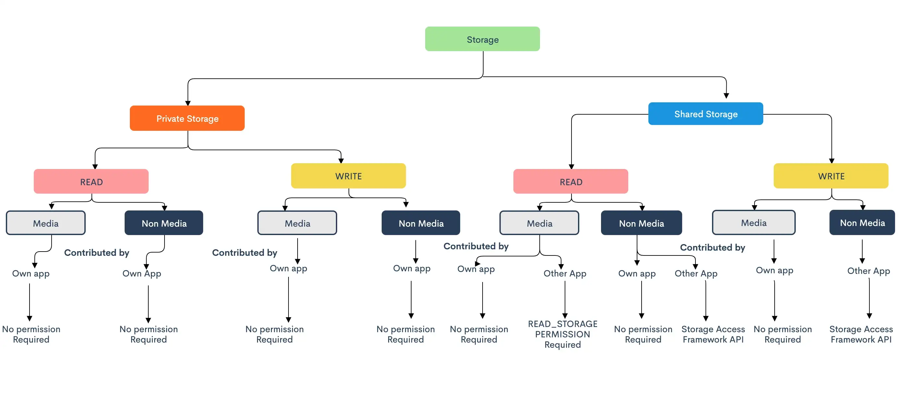

### 💾 Запись и чтение файлов 📖

[все лекции](https://github.com/dmitryweiner/android-lectures/blob/master/README.md)

---

### Места для хранения файлов
* Private storage - внутренний каталог приложения. 
Туда может писать и читать только наше приложение, зато без запроса разрешений.
* Shared storage - общее хранилище файлов, куда имеют доступ многие приложения.
  * EXTERNAL_STORAGE - внешняя SD-карта.

---

### Изменения в API Android
* <= 6 - можно писать на SD-карту, указав это в Manifest.xml.
* <= 10 - можно писать на карту, запросив разрешение во время выполнения.
* 11 - можно писать только в Scoped storage:
  * Фото.
  * Документы.
  * Загрузки.
---

### Запись в Private storage

```kotlin
fun writeToPrivateStorage() {
    val FILE_NAME = "file.txt"
    var fos: FileOutputStream? = null
    try {
        val text = "Какие-то данные"
        fos = openFileOutput(FILE_NAME, MODE_PRIVATE)
        fos.write(text.toByteArray())
        Toast.makeText(this, "Файл сохранен по адресу ${getFileStreamPath(FILE_NAME)}", Toast.LENGTH_SHORT)
            .show()
    } catch (ex: IOException) {
        Toast.makeText(this, ex.message, Toast.LENGTH_SHORT).show()
    } finally {
        try {
            if (fos != null) fos.close()
        } catch (ex: IOException) {
            Toast.makeText(this, ex.message, Toast.LENGTH_SHORT).show()
        }
    }
}
```

Пишет файл в `/data/data/%PACKAGE_NAME%/files/file.txt`
---

### Чтение из private storage

```kotlin
fun readFromPrivateStorage() {
    val FILE_NAME = "file.txt"
    var fin: FileInputStream? = null
    try {
        fin = openFileInput(FILE_NAME)
        val bytes = ByteArray(fin.available())
        fin.read(bytes)
        val text = String(bytes)
        Toast.makeText(this, "Данные из файла: ${text}", Toast.LENGTH_SHORT).show()
    } catch (ex: IOException) {
        Toast.makeText(this, ex.message, Toast.LENGTH_SHORT).show()
    } finally {
        try {
            if (fin != null) fin.close()
        } catch (ex: IOException) {
            Toast.makeText(this, ex.message, Toast.LENGTH_SHORT).show()
        }
    }
}
```
---

### Запись в shared storage
* Добавить нужные права в `AndroidManifest.xml`.
* [Запросить права во время выполнения](https://dmitryweiner.github.io/android-lectures/Permissions.html#/11).
* Записать файл.
---

### Добавление прав в AndroidManifest.xml
```xml
<uses-permission android:name="android.permission.WRITE_EXTERNAL_STORAGE" />
<uses-permission android:name="android.permission.READ_EXTERNAL_STORAGE" />
<application 
    android:requestLegacyExternalStorage="true"
    ...
    >
    <!-- ... -->
</application>
```
---

### Запись в shared storage

```kotlin
fun writeToSharedStorage() {
    val FILE_NAME = "file.txt"
    var path: File? = null
    if (Build.VERSION.SDK_INT >= Build.VERSION_CODES.R) {
        path = Environment.getExternalStoragePublicDirectory(
            // тут можно выбрать, в какой каталог писать
            Environment.DIRECTORY_DOCUMENTS
        )
    } else {
        path = Environment.getExternalStorageDirectory()
    }

    var fos: FileOutputStream? = null
    try {
        val text = "Какие-то данные"
        val file = File(path, FILE_NAME)
        file.createNewFile()
        fos = FileOutputStream(file);
        fos.write(text.toByteArray())
        Toast.makeText(
            this,
            "Файл сохранен по адресу ${file.absolutePath}",
            Toast.LENGTH_SHORT
        )
            .show()
    } catch (ex: Exception) {
        Toast.makeText(this, ex.message, Toast.LENGTH_SHORT).show()
    } finally {
        try {
            if (fos != null) fos.close()
        } catch (ex: IOException) {
            Toast.makeText(this, ex.message, Toast.LENGTH_SHORT).show()
        }
    }
}
```
---

### Варианты каталогов

```kotlin
path = Environment.getExternalStoragePublicDirectory(
    // тут можно выбрать, в какой каталог писать
    Environment.DIRECTORY_DOCUMENTS
)
```

```java
public class Environment {
    public static String DIRECTORY_ALARMS = "Alarms";
    public static String DIRECTORY_AUDIOBOOKS = "Audiobooks";
    public static String DIRECTORY_DCIM = "DCIM";
    public static String DIRECTORY_DOCUMENTS = "Documents";
    public static String DIRECTORY_DOWNLOADS = "Download";
    public static String DIRECTORY_MOVIES = "Movies";
    public static String DIRECTORY_MUSIC = "Music";
    public static String DIRECTORY_NOTIFICATIONS = "Notifications";
    public static String DIRECTORY_PICTURES = "Pictures";
    public static String DIRECTORY_PODCASTS = "Podcasts";
    public static String DIRECTORY_RECORDINGS = "Recordings";
    public static String DIRECTORY_RINGTONES = "Ringtones";
    public static String DIRECTORY_SCREENSHOTS = "Screenshots";
}
```
---



---

### Чтение из shared storage

```kotlin
fun readFromSharedStorage() {
    val FILE_NAME = "file.txt"
    var path: File? = null
    if (Build.VERSION.SDK_INT >= Build.VERSION_CODES.R) {
        path = Environment.getExternalStoragePublicDirectory(
            // тут можно выбрать, из какого каталога читать
            Environment.DIRECTORY_DOCUMENTS
        )
    } else {
        path = Environment.getExternalStorageDirectory()
    }

    var fin: FileInputStream? = null
    try {
        val file = File(path, FILE_NAME)
        fin = FileInputStream(file);
        val bytes = ByteArray(fin.available())
        fin.read(bytes)
        val text = String(bytes)
        Toast.makeText(this, "Данные из файла: ${text}", Toast.LENGTH_SHORT).show()
    } catch (ex: Exception) {
        Toast.makeText(this, ex.message, Toast.LENGTH_SHORT).show()
    } finally {
        try {
            if (fin != null) fin.close()
        } catch (ex: IOException) {
            Toast.makeText(this, ex.message, Toast.LENGTH_SHORT).show()
        }
    }
}
```
---

### Запись с помощью интента

```kotlin
val CREATE_FILE = 1
fun writeViaIntent() {
    val FILE_NAME = "file.txt"
    val intent = Intent(Intent.ACTION_CREATE_DOCUMENT)
    intent.addCategory(Intent.CATEGORY_OPENABLE)
    intent.type = "application/txt"
    intent.putExtra(Intent.EXTRA_TITLE, FILE_NAME)
    startActivityForResult(intent, CREATE_FILE)
}

override fun onActivityResult(
    requestCode: Int, resultCode: Int, resultData: Intent?) {
    super.onActivityResult(requestCode, resultCode, resultData)
    val text = "Какие-то данные"
    if (requestCode == CREATE_FILE
        && resultCode == Activity.RESULT_OK) {
        resultData?.data?.also { uri ->
            Toast.makeText(this, "Файл сохранён: ${uri.toString()}", Toast.LENGTH_SHORT).show()
            val fos = contentResolver.openOutputStream(uri)
            fos?.write(text.toByteArray())
        }
    }
}
```
---

### Чтение с помощью интента

```kotlin
```
---

### Демо-репозиторий

https://github.com/dmitryweiner/kotlin-write-files

---

### Полезные ссылки
* https://learntodroid.com/android-file-io-tutorial-with-internal-and-external-storage/
* https://androidexplained.github.io/android/android11/scoped-storage/2020/09/29/file-saving-android-11.html
* https://betterprogramming.pub/android-scoped-storage-demystified-3024a062ba24
* https://www.digitalocean.com/community/tutorials/android-external-storage-read-write-save-file
* https://stackoverflow.com/questions/65637610/saving-files-in-android-11-to-external-storagesdk-30

---


