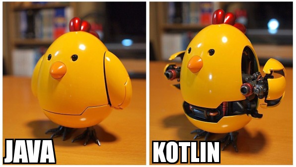
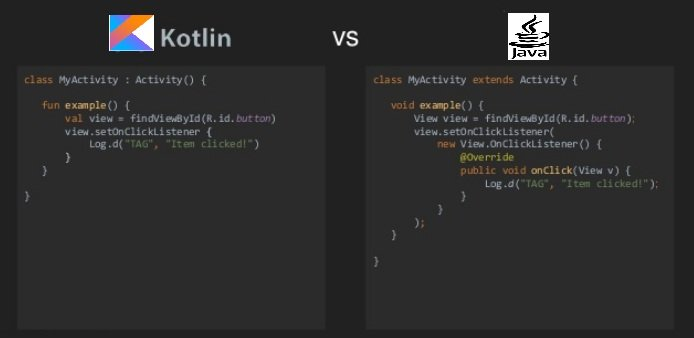
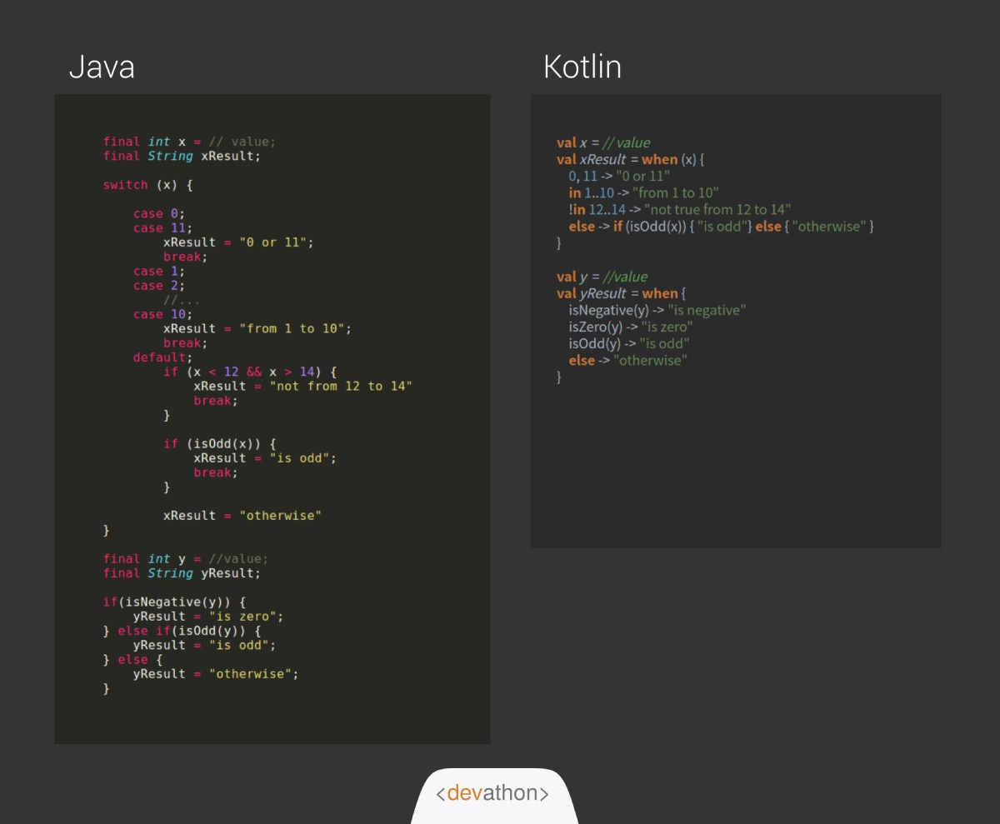
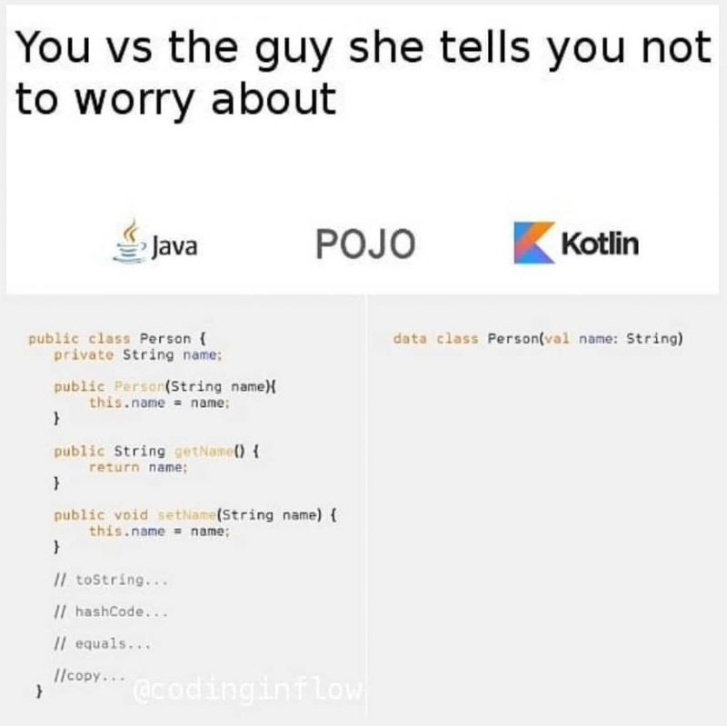

## Основы

[все лекции](https://github.com/dmitryweiner/android-lectures/blob/main/README.md)
---

### История создания
* Дата создания: июль 2011.
* Автор: [Андрей Бреслав](https://twitter.com/abreslav).
* Котлин &mdash; остров в Финском заливе.
* [Документация](https://kotlinlang.org/docs/home.html).


---

### Основные особенности
* Статически типизирован.
* Умеет выводить типы (как TypeScript).
* Компилируется в байт-код.
* Исполняется на JVM.
* Полностью функционально совместим с Java (лёгкая миграция).
* Есть ООП.
---

### Почему Kotlin, а не Java
* Лаконичность.
* Легче работать с типами.
* Легче создавать классы.


---


---


---


---

### Объявление переменных
* val для неизменных переменных:
```kotlin
val a = 1
```
* var для изменяемых переменных:
```kotlin
var i: Int
i = 1
i++
```
* **Всегда** лучше предпочитать val для [иммутабельности данных](https://ru.wikipedia.org/wiki/%D0%9D%D0%B5%D0%B8%D0%B7%D0%BC%D0%B5%D0%BD%D1%8F%D0%B5%D0%BC%D1%8B%D0%B9_%D0%BE%D0%B1%D1%8A%D0%B5%D0%BA%D1%82).

---

### Типы данных
* Целые: Byte (8), Short (16), Int (32), Long (64).
* Дробные: Float (32), Double (64).
* Boolean.
* Char, String.
* Array.
* Object.
* [Подробнее](https://kotlinlang.org/docs/basic-types.html).
---

### Автоматический вывод типа
* Если переменной при объявлении присваивается значение, тип указывать **не надо**:
```kotlin
val a = 1 // Int
val s = "123" // String
```
---

### Строки и шаблоны
* Char:
```kotlin
val ch = '1' // Char
```
* Многострочная строка:
```kotlin
val text = """
    for (c in "foo")
    print(c)
"""
```
* Использование шаблонов:
```kotlin
val i = 10
println("i = $i") // prints "i = 10"
```
---

### Явная конвертация типов
```kotlin
val b: Byte = 1 // OK, literals are checked statically
// val i: Int = b // ERROR
val i1: Int = b.toInt()
```
* toByte(): Byte
* toShort(): Short
* toInt(): Int
* toLong(): Long
* toFloat(): Float
* toDouble(): Double
* toChar(): Char
---

### Проверка и приведение типа
* Проверка типа:
```kotlin
if (x is String) {
    print(x.length)
}
```
* Приведение типа:
```kotlin
val x: String = y as String
```
* [Подробнее](https://kotlinlang.org/docs/typecasts.html).
---

### Null safety
https://kotlinlang.org/docs/null-safety.html

---

### Операторы

---

### Ветвление

---

### Функции

---

### Именованные аргументы

---

### Лямбды

---

### Задачи
---

### Полезные ссылки
* [Документация](https://kotlinlang.org/docs/home.html).
* [Игровая площадка](https://play.kotlinlang.org/).
* [Задачи с решениями](https://play.kotlinlang.org/koans/Introduction/Hello,%20world!/Task.kt).
* [Учебник по Kotlin (англ.)](https://www.youtube.com/watch?v=F9UC9DY-vIU).
* [Учебник по Kotlin (рус.)](https://www.youtube.com/watch?v=30tchn0TjaM).


