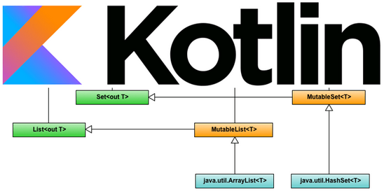
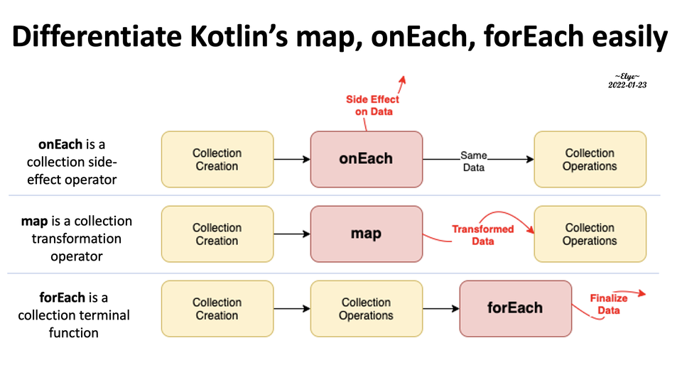
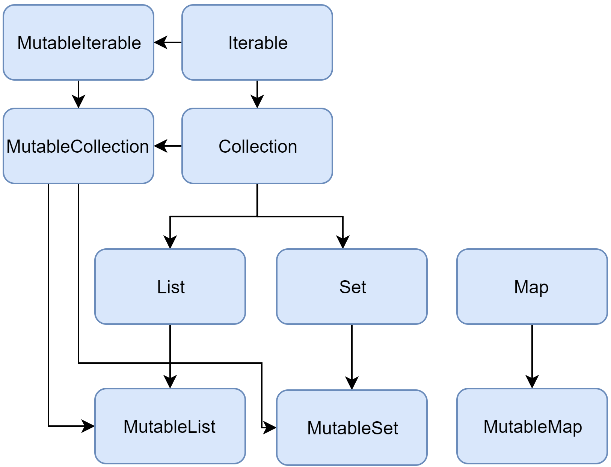

### Коллекции, Stream API



[все лекции](https://github.com/dmitryweiner/android-lectures/blob/main/README.md)

[видео](https://youtu.be/EpPdwcr5vJw)
---

### Создание массива
* Через конструктор:

```kotlin
val arr = Array(3) { i -> i * 2 } // [2, 4, 6]
```

Первый параметр - размер. Второй параметр - лямбда для заполнения.
* Через `arrayOf`:

```kotlin
val arr = arrayOf(1, 2, 3)
```
---

### Массив и типы
* Типизированный:

```kotlin
val arr = arrayOf<Int>(1, 2, 3)
```

* Можно создавать методами `intArrayOf(), harArrayOf(), booleanArrayOf(), longArrayOf(), shortArrayOf(), byteArrayOf().`
* Смешанный:

```kotlin
val myArray = arrayOf(1, 2, 3, 4, 5, "зайчик", "вышел", "погулять")
```
---

### Массив как аргумент функции
* Массив можно указывать как тип переменной или аргумента:
```kotlin
fun calc(arr: Array<Int>) {
    /* ... */
}
```
---

### Размер массива
* Хранится в свойстве `.size`:
```kotlin
val arr = arrayOf(1, 2, 3)
println(arr.size) // 3
```
---

### Проверка, есть ли такой элемент
* Используется оператор `in`:
```kotlin
val arr = arrayOf(1, 2, 3)
println(4 in arr)       // false
println(2 !in arr)      // true
```
---

### Перебор массива
* Перебор элементов с помощью `for`:

```kotlin
val arr = arrayOf<Int>(1, 2, 3)
for(item in arr) {
  println(item)
}
```

* Перебор с помощью `.forEach`:

```kotlin
val arr = arrayOf<Int>(1, 2, 3)
arr.forEach { println(it) }
```
---

### Перебор индексов
```kotlin
val arr = arrayOf<Int>(1, 2, 3)

// через for
// Внимание! Используем свойство arr.indices
for(index in arr.indices) {
  println(index)
}

// через .forEach
arr.indices.forEach { println(it) }
```
---

### Различия onEach и forEach


---

### Трансформация с помощью map
* `map` применяет лямбду к каждому элементу массива и возвращает новый массив:

```kotlin
val arr = Array(5) { it }
// 0, 1, 2, 3, 4
val arr2 = arr.map { it * it } // возвести в квадрат
// 0, 1, 4, 9, 16
val arr3 = arr.map { it.toString() } // преобразовать в строки
// "0", "1", "2", "3", "4"
```
---

### Сортировка
* sort:

```kotlin
val numbers: IntArray = intArrayOf(7, 5, 8, 4, 9, 6, 1, 3, 2)
numbers.sort()
// 1, 2, 3, 4, 5, 6, 7, 8, 9
```
* Сортировка с компаратором sortWith:

```kotlin
data class User(val name: String, val age: Int)
val users = arrayOf(User("Вася", 19), User("Катя", 18), User("Петя", 20), User("Маша", 17))
users.sortWith(Comparator { u1, u2 -> u1.age - u2.age })
// User(name=Маша, age=17), User(name=Катя, age=18), User(name=Вася, age=19), User(name=Петя, age=20)
```

* Сорировка по полю объекта:
```kotlin
users.sortBy { it.age }
```
---

### Фильтрация
```kotlin
val numbers: IntArray = intArrayOf(7, 5, 8, 4, 9, 6, 1, 3, 2)

// все чётные
val filteredNumbers = numbers.filter { it % 2 == 0 }
// 8, 4, 6, 2

// все нечётные
val filteredNumbers2 = numbers.filter { it % 2 != 0 }
// 7, 5, 9, 1, 3
```
---

### Поиск
* find:
```kotlin
val numbers: IntArray = intArrayOf(7, 5, 8, 4, 9, 6, 1, 3, 2)
numbers.find { it % 2 == 0 } // найти первый четный
// 8
```
* findLast:
```kotlin
val numbers: IntArray = intArrayOf(7, 5, 8, 4, 9, 6, 1, 3, 2)
numbers.findLast { it % 2 == 0 } // найти последний четный
// 2
```
---

### Различия в окончаниях
* Методы, оканчивающиеся на _-ed_ возвращают новый массив, не изменяя исходный.
* Аналогичные методы без _-ed_ меняют сам массив.

```kotlin
val numbers: IntArray = intArrayOf(7, 5, 8, 4, 9, 6, 1, 3, 2)
numbers.sorted() // возвращает 1, 2, 3, 4, 5, 6, 7, 8, 9
numbers // тут лежит 7, 5, 8, 4, 9, 6, 1, 3, 2
numbers.sort() // ничего не возвращает
numbers // теперь тут лежит 1, 2, 3, 4, 5, 6, 7, 8, 9
```
---

### List, Map, Set
* `List` (список) - упорядоченная коллекция, в которой к элементам можно обращаться по целым индексам. Могут быть дубликаты.
* `Set` (множество) - коллекция уникальных элементов.
* `Map` (словарь, ассоциативный список) - набор из пар "ключ-значение". Ключи уникальны и каждый из них соответствует ровно одному значению. Значения могут иметь дубликаты.
---

### 2 вида интерфейсов
* Неизменяемый ( read-only) - предоставляет операции, которые дают доступ к элементам коллекции.
* Изменяемый (mutable) - расширяет предыдущий интерфейс и дополнительно даёт доступ к операциям добавления, удаления и обновления элементов коллекции.
---


---

### List
```kotlin
val numbers = listOf("one", "two", "three", "four")

//размер списка
println(numbers.size) // 4

// получение элемента по индексу
println(numbers.get(2)) // three

// получение элемента по индексу (так тоже можно)
println(numbers[3]) // four

// поиск индекса элемента
println(numbers.indexOf("two")) // 1 
```

---

### Mutable List
```kotlin
val numbers = mutableListOf("one", "two", "three", "four")

numbers.add("five")
println(numbers.joinToString(", ")) // one, two, three, four, five
```
---

### Set 
```kotlin
val numbers = mutableSetOf(1, 2, 3, 3, 3, 4)

println(numbers.joinToString(", ")) // 1, 2, 3, 4
numbers.add(5)
println(numbers.joinToString(", ")) // 1, 2, 3, 4, 5
```
---

### Map
```kotlin
val numbersMap = mapOf("key1" to 1, "key2" to 2, "key3" to 3, "key4" to 1)

println("All keys: ${numbersMap.keys}") // [key1, key2, key3, key4]
println("All values: ${numbersMap.values}") // [1, 2, 3, 1]

if ("key2" in numbersMap) println("Value by key \"key2\": ${numbersMap["key2"]}")    
if (1 in numbersMap.values) println("The value 1 is in the map")
if (numbersMap.containsValue(1)) println("The value 1 is in the map") // аналогичен предыдущему условию
```
---

### Mutable Map
```kotlin
val map = mutableMapOf(
        "key1" to 1,
        "key2" to 2,
        "key3" to 3,
        "key4" to 4)

// добавить новое значение
map.put("key5", 5)

// инкрементировать значение
map["key4"] = map["key4"]!! + 1

// или так
map["key4"] = map.getOrDefault("key4", 0) + 1
```
---

### Задачи
#### Задачи необходимо решать в виде функции, принимающей на вход массив, возвращающей ответ
* Найти максимальную разницу между элементами массива.
* Найти, сколько есть в массиве пар чисел, дающих в сумме 0:
```kotlin
f(arrayOf(-7, 12, 4, 6, -4, -12, 0)) // 2 
f(arrayOf(-1, 2, 4, 7, -4, 1, -2)) // 3
f(arrayOf(-1, 1, 0, 1)) // 1
f(arrayOf(-1, 1, -1, 1)) // 2
f(arrayOf(1, 1, 1, 0, -1)) // 1
f(arrayOf(0, 0)) // 1 
f(arrayOf()) // 0 
```
---

* Реализовать функцию, которой на вход подаётся массив целых чисел со знаком,
   функция возвращает, сколько раз сменился знак.
```kotlin
signCount(arrayOf(1, 0, -1, -3, -5, 5, -1)) === 3
signCount(arrayOf(1, 0, 1, 3, 5, 5, 1)) === 0
signCount(arrayOf(-11, 1, 3, 5, 1)) === 1
```
---

* Написать функцию, возвращающую самый часто встречающийся символ в переданной строке:

```kotlin
mostCommon("isefe5i35fiuo34iuq") // 'i'
```

* Написать функцию, принимающую на вход строку, состоящую из слов, разделённых пробелами,
    и возвращающую самое редко встречающееся слово:

```kotlin
mostRare("ток кот кукож ток кот") // "кукож"
mostRare(
  "кот ток кот кукож ток кот ток кукож"
) // "кукож"
```
---

### Полезные ссылки
* https://developer.alexanderklimov.ru/android/kotlin/array.php
* https://metanit.com/kotlin/tutorial/2.3.php
* https://bimlibik.github.io/posts/kotlin-collections/
* https://kotlinlang.ru/docs/collections-overview.html
