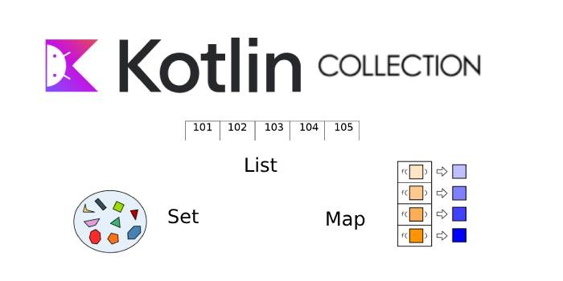
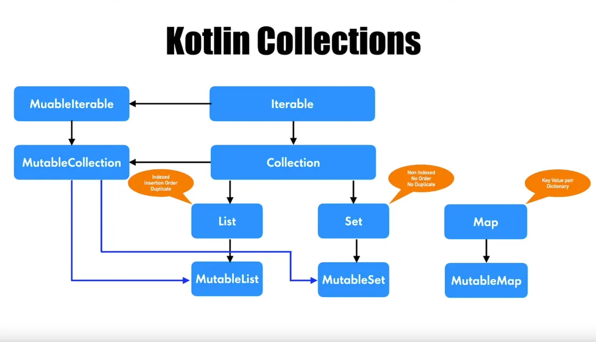

### Коллекции



[все лекции](https://github.com/dmitryweiner/android-lectures/blob/master/README.md)

[видео](https://youtu.be/EpPdwcr5vJw)
---

### Коллекции
* Статические коллекции:
  * List: список значений.
  * Map: список пар ключ-значение.
  * Set: список уникальных значений.
* Динамические коллекции (можно добавлять/удалять элементы):
  * MutableList.
  * MutableMap.
  * MutableSet.
---


---

### List, Map, Set
* `List` (список) - упорядоченная коллекция, в которой к элементам можно обращаться по целым индексам. Могут быть дубликаты.
* `Set` (множество) - коллекция уникальных элементов.
* `Map` (словарь, ассоциативный список) - набор из пар "ключ-значение". Ключи уникальны и каждый из них соответствует ровно одному значению. Значения могут иметь дубликаты.
---

### 2 вида интерфейсов
* Неизменяемый (read-only) - предоставляет операции, которые дают доступ к элементам коллекции.
* Изменяемый (mutable) - расширяет предыдущий интерфейс и дополнительно даёт доступ к операциям добавления, удаления и обновления элементов коллекции.
---


---

### List
```kotlin
val numbers = listOf("one", "two", "three", "four")

//размер списка
println(numbers.size) // 4

// получение элемента по индексу
println(numbers.get(2)) // three

// получение элемента по индексу (так тоже можно)
println(numbers[3]) // four

// поиск индекса элемента по значению
println(numbers.indexOf("two")) // 1 
```

---

### Mutable List
```kotlin
val numbers = mutableListOf("one", "two", "three", "four")

numbers.add("five") // добавление элемента

numbers.remove("one") // удаление элемента

numbers[0] = "два"

println(numbers.joinToString(", ")) // два, three, four, five
```
---

### Set 
```kotlin
val numbers = mutableSetOf(1, 2, 3, 3, 3, 4)

println(numbers.joinToString(", ")) // 1, 2, 3, 4
numbers.add(5)
println(numbers.joinToString(", ")) // 1, 2, 3, 4, 5
```
---

### Map
```kotlin
val numbersMap = mapOf("key1" to 1, "key2" to 2, "key3" to 3, "key4" to 1)

println("All keys: ${numbersMap.keys}") // [key1, key2, key3, key4]
println("All values: ${numbersMap.values}") // [1, 2, 3, 1]

if ("key2" in numbersMap) println("Value by key \"key2\": ${numbersMap["key2"]}")    
if (1 in numbersMap.values) println("The value 1 is in the map")
if (numbersMap.containsValue(1)) println("The value 1 is in the map") // аналогичен предыдущему условию
```
---

### Mutable Map
```kotlin
val map = mutableMapOf(
        "key1" to 1,
        "key2" to 2,
        "key3" to 3,
        "key4" to 4)

// добавить новое значение
map.put("key5", 5)

// инкрементировать значение
map["key4"] = map["key4"]!! + 1

// или так
map["key4"] = map.getOrDefault("key4", 0) + 1
```
---

### Задачи
#### Задачи необходимо решать в виде функции, принимающей на вход массив, возвращающей ответ
* Найти максимальную разницу между элементами массива.
```kotlin
f(arrayOf(-7, 12, 4, 6, -4, -12, 0)) // 24 
f(arrayOf()) // 0 
```
---

* Найти, сколько есть в массиве пар чисел, дающих в сумме 0.
Число из пары не может участвовать в других парах.
```kotlin
f(arrayOf(-7, 12, 4, 6, -4, -12, 0)) // 2 
f(arrayOf(-1, 2, 4, 7, -4, 1, -2)) // 3
f(arrayOf(-1, 1, 0, 1)) // 1
f(arrayOf(-1, 1, -1, 1)) // 2
f(arrayOf(1, 1, 1, 0, -1)) // 1
f(arrayOf(0, 0)) // 1 
f(arrayOf()) // 0 
```
---

* Реализовать функцию, которой на вход подаётся массив целых чисел со знаком,
   функция возвращает, сколько раз сменился знак.
```kotlin
signCount(arrayOf(1, 0, -1, -3, -5, 5, -1)) === 3
signCount(arrayOf(1, 0, 1, 3, 5, 5, 1)) === 0
signCount(arrayOf(-11, 1, 3, 5, 1)) === 1
```
---

* Написать функцию, возвращающую самый часто встречающийся символ в переданной строке:

```kotlin
mostCommon("isefe5i35fiuo34iuq") // 'i'
```

* Написать функцию, принимающую на вход строку, состоящую из слов, разделённых пробелами,
    и возвращающую самое редко встречающееся слово:

```kotlin
mostRare("ток кот кукож ток кот") // "кукож"
mostRare(
  "кот ток кот кукож ток кот ток кукож"
) // "кукож"
```
---

### Задачи
https://developer.android.com/codelabs/basic-android-kotlin-training-collections
---

### Полезные ссылки
* https://developer.alexanderklimov.ru/android/kotlin/array.php
* https://metanit.com/kotlin/tutorial/2.3.php
* https://bimlibik.github.io/posts/kotlin-collections/
* https://kotlinlang.ru/docs/collections-overview.html
