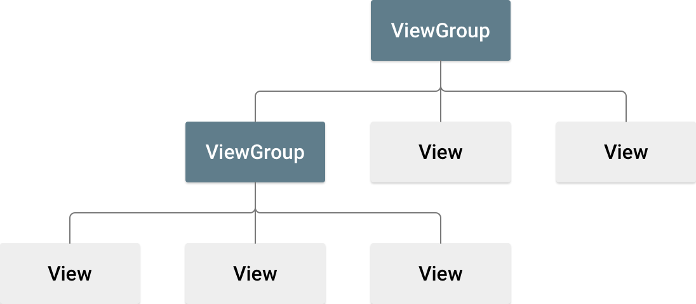
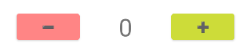

### Разметка, работа с компонентами


[все лекции](https://github.com/dmitryweiner/android-lectures/blob/main/README.md)

[видео]()
---

### Иерархия компонентов


---
### Виды ViewGroup
* Лейауты:
  * Constraint Layout - компоненты расположены в соответствии с правилами друг относительно друга.
  * Linear Layout - компоненты расположены линейно (горизонтально или вертикально).
  * Relative Layout - похоже на Constraint, устаревший.
  * [Подробнее](https://developer.android.com/develop/ui/views/layout/declaring-layout).
* Контейнеры:
  * RecyclerView - потенциально бесконечный список.
  * Spinner - <select><option>1</option><option>2</option><option>2</option></select>.
  * Fragment - переиспользуемый кусочек активити.
---

### Constraint Layout
* [Исчерпывающее руководство](https://developer.alexanderklimov.ru/android/layout/constraintlayout.php).
* Основная идея: для "резиновой" вёрстки позиционировать компоненты относительно родителя или соседей:


---

### Linear Layout
* [Руководство](http://developer.alexanderklimov.ru/android/layout/linearlayout.php).
* Идея: располагать элементы в строку либо в столбец.


---

### Recycler View
* [Руководство](https://developer.alexanderklimov.ru/android/views/recyclerview-kot.php).
* Идея: переиспользовать элементы списка для отображения следующих элементов.


---

### Палитра компонентов

  
---

### Текст

```xml
<TextView
   android:id="@+id/textView"
   android:layout_width="wrap_content"
   android:layout_height="wrap_content"
   android:text="TextView" />
```

```kotlin
class MainActivity : AppCompatActivity() {
    override fun onCreate(savedInstanceState: Bundle?) {
        super.onCreate(savedInstanceState)
        setContentView(R.layout.activity_main)

        val textView = findViewById<TextView>(R.id.textView)
        textView.text = "У рыб нет зуб"
    }
}
```

> У рыб нет зуб
---

### Кнопка
```xml
<Button
   android:id="@+id/button"
   android:layout_width="wrap_content"
   android:layout_height="wrap_content"
   android:text="Button" />
```

```kotlin
class MainActivity : AppCompatActivity() {
    override fun onCreate(savedInstanceState: Bundle?) {
        super.onCreate(savedInstanceState)
        setContentView(R.layout.activity_main)

        val button = findViewById<Button>(R.id.button)
        button.setOnClickListener { button.text = "Ура, на меня нажали!" }
    }
}
```
<button>Ура, на меня нажали!</button>
---

### Как это работает?
* Функция `findViewById` ищет нужный View для навешивания обработчиков или изменения состояния.
* `setOnClickListener` навешивает обработчик на событие "клик" у найденной кнопки.
* Обработчик состоит из лямбды, изменяющей текст кнопки.
---

### Кликер
```xml
<TextView android:id="@+id/textView"
   android:layout_width="wrap_content"
   android:layout_height="wrap_content"
   android:text="TextView" />
<Button android:id="@+id/button"
   android:layout_width="wrap_content"
   android:layout_height="wrap_content"
   android:text="Button" />
```

```kotlin
class MainActivity : AppCompatActivity() {
    var i = 0
    override fun onCreate(savedInstanceState: Bundle?) {
        super.onCreate(savedInstanceState)
        setContentView(R.layout.activity_main)
        val textView = findViewById<TextView>(R.id.textView)
        val button = findViewById<Button>(R.id.button)
        button.setOnClickListener {
            textView.text = i.toString()
            i++
        }
    }
}
```
---
 
### Поле ввода

```xml
<EditText
   android:id="@+id/editText"
   android:layout_width="wrap_content"
   android:layout_height="wrap_content"
   android:ems="10"
   android:inputType="textPersonName"
   android:text="Тут какой-то введённый текст"/>
```

```kotlin
val editText = findViewById<EditText>(R.id.editText)
button.setOnClickListener {
   // прочитать введённый текст
   val text = editText.text.toString()
   // записать строку
   editText.setText(text.reversed())
}
```

<input type="text" value="Тут какой-то введённый текст">
---
### Типизированные поля ввода
* Можно использовать поля ввода, автоматически фильтрующие текст:
    * Число.
    * Email.
    * Телефон.
    * Дата.
* [Варианты](https://developer.alexanderklimov.ru/android/views/edittext.php).


---
 
### Подписка на изменения поля
* Можно подписаться на изменения EditText, если нужно реагировать на ввод в реальном времени.
* [Подробнее](https://developer.android.com/reference/android/text/TextWatcher).

```kotlin
editText.addTextChangedListener(object : TextWatcher {
 // после того, как текст редактировали
 override fun afterTextChanged(s: Editable) {   
  s.toString() // новая строка!
 }
 // перед тем, как текст редактировали
 override fun beforeTextChanged(s: CharSequence, start: Int, count: Int, after: Int) {
 }
 // во время ввода, изменение строки уже произошло
 override fun onTextChanged(s: CharSequence, start: Int, before: Int, count: Int) {
 }
})
```
---
 
### Переключатель

```xml
<Switch
   android:id="@+id/switch"
   android:layout_width="wrap_content"
   android:layout_height="wrap_content"
   android:text="Switch"/>
```

```kotlin
val switch = findViewById<Switch>(R.id.switch)
// текущее состояние
switch.isChecked
// реакция на переключение
switch.setOnCheckedChangeListener { 
   compoundButton, b -> editText.setText(if (b) "Включено" else "Выключено")
}
```
---
 
### Радио-кнопки


```xml
<RadioGroup
   android:id="@+id/radioGroup"
   android:layout_width="match_parent"
   android:layout_height="wrap_content"
   android:background="#333333"
   android:orientation="horizontal">
   <RadioButton
   android:id="@+id/radio1"
   android:layout_width="match_parent"
   android:layout_height="wrap_content"
   android:layout_marginLeft="24dp"
   android:layout_weight="1" />
   <RadioButton
   android:id="@+id/radio2"
   android:layout_width="match_parent"
   android:layout_height="wrap_content"
   android:layout_marginLeft="24dp"
   android:layout_weight="1" />
</RadioGroup>
```
---

### Радио-кнопки
[Подробнее](https://developer.alexanderklimov.ru/android/views/radiobutton.php)

```kotlin
val radioButton = findViewById<RadioButton>(R.id.radio1)
// текущее состояние
radioButton.isChecked

// реакция на события
val radioGroup = findViewById<RadioGroup>(R.id.radioGroup)
radioGroup.setOnCheckedChangeListener { 
  radioGroup, i -> /* i -- номер выбранного пункта */
}
```
---
 
### Выпадающий список


```xml
<Spinner
   android:id="@+id/spinner"
   android:layout_width="0dp"
   android:layout_height="wrap_content" />
```

```kotlin
val spinner = findViewById<Spinner>(R.id.spinner)
val options = arrayOf("камень", "ножницы", "бумага")
val adapter = ArrayAdapter(this, android.R.layout.simple_spinner_item, options)
spinner.adapter = adapter
```
---

### Выпадающий список
* Как прочитать значение:

```kotlin
// текущая выбранная опция
spinner.selectedItemPosition

// реакция на выбор
spinner.setOnItemClickListener {
   adapterView, view, i, l -> /* i - номер выбранного пункта */
}
```
* [Как настроить его вид и задавать данные для списка](https://developer.alexanderklimov.ru/android/views/spinner.php).
---

### Тосты

* Иногда хочется показать пользователю сообщение, но не на текущем экране, а поверх.
* Для этого используются тосты:

```kotlin
val toast = Toast.makeText(
   applicationContext, 
   "Ура, я тост!",
   Toast.LENGTH_SHORT); 
toast.show(); 
```
* У тостов можно настраивать место [появления, вид](https://developer.alexanderklimov.ru/android/toast.php).
---

### Задачи
* Написать кликер с + и -. Сделать так, чтобы он не заходил в отрицательные числа.




---

### Полезные ссылки
* https://developer.alexanderklimov.ru/android/layout/constraintlayout.php
* https://developer.alexanderklimov.ru/android/views/recyclerview-kot.php