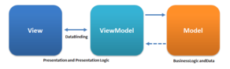
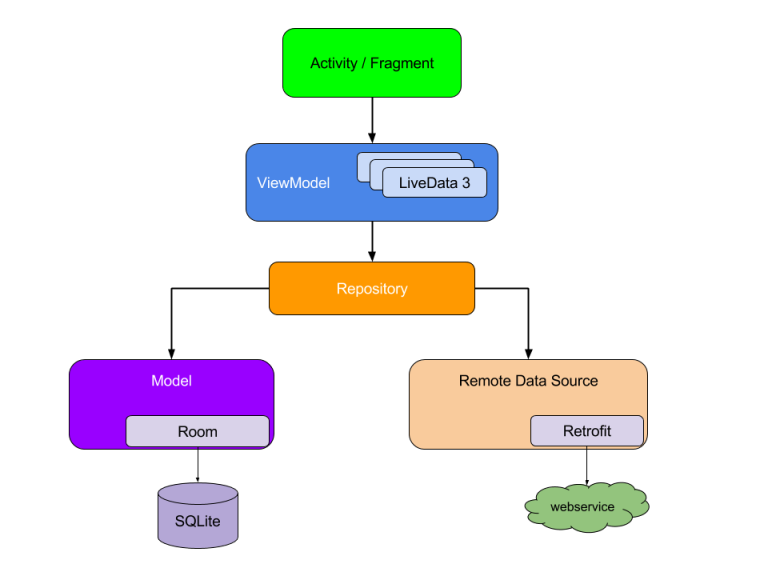
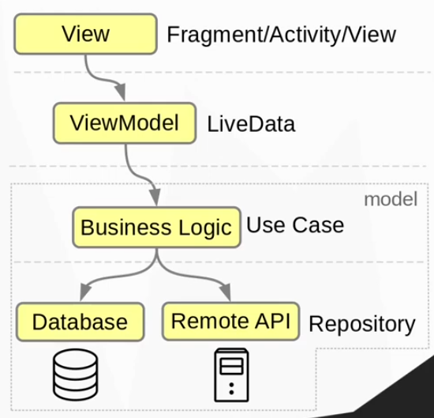
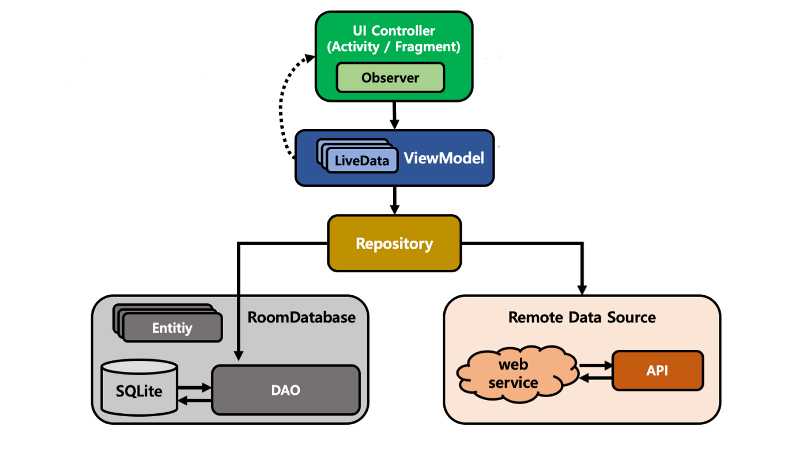

### Реализация архитектуры MVVM



[все лекции](https://github.com/dmitryweiner/android-lectures/blob/master/README.md)

[видео]()
---


---


---

### Идея класса ViewModel
* Activity умирает и возрождается в течение жизненного цикла.
* Состояние UI нужно хранить в классе, переживающем перезагрузку activity, - ViewModel.
* Данные должны быть отделены от представления, они лежат в модели.
* ViewModel - прослойка между источником данных и View (Activity/Fragment).
---

### Жизненный цикл

---

### Установка библиотеки для работы с ViewModel
* build.gradle (module):

```
android {
    compileSdk 33 // <--

    defaultConfig {
        targetSdk 33 // <--
        // ...
    }
}
dependencies {
    // ...
    implementation 'androidx.activity:activity-ktx:1.6.1'
}
```
---

### Простейшая ViewModel
```kotlin
class MainViewModel : ViewModel() {

    private var counter = 0

    fun incrementCounter() {
        counter++
    }

    fun getCounter(): Int {
        return counter
    }
}

// in Activity
val viewModel: MainViewModel by viewModels()
// изменение данных
viewModel.incrementCounter()

// получение данных
viewModel.getCounter()
```
---

### AndroidLiveModel
* Наследник класса ViewModel, обладающий информацией о владельце данного конкретного ViewModel.
* Применяется для случаев, когда нужен текущий контекст, например для создания Room.databaseBuilder:

```kotlin
class MainViewModel(context: Application) : AndroidViewModel(context) {

    init {
        // в applicationContext ссылка на текущую Activity
        context.applicationContext
    }
}
```
---

### Утечки памяти
* Из-за того, что ViewModel живёт дольше, чем Activity, могут
происходить утечки памяти.
* Чтобы их не было, во ViewModel не должно быть ссылок на вьюшки в Activity.
* Проще говоря, ViewModel не должна "знать", как и где она будет отображаться.
* [Подробнее](https://habr.com/ru/post/338590/). 
---

### LiveData
`LiveData` — это контейнер, который следит за жизненным циклом экрана и снабжает его данными, когда это уместно. 

Например, если активити находится на переднем плане и видна пользователю. Ценность такого подхода заключается в том, что LiveData не будет снабжать ваш экран данными, если он свёрнут или закрыт. 

Но как только экран появится перед пользователем, обновление данных возобновится.
---

### LiveData
* Класс, реализующий шину событий.
* Activity подписывается на изменение данных и получает всегда свежее значение.
* Изменение данных делается методами в классе `MutableLiveData`:
    * setValue(newValue) - из основного потока.
    * postValue(newValue) - из всех остальных потоков.
* [Подробнее про LiveData](https://startandroid.ru/ru/courses/architecture-components/27-course/architecture-components/526-urok-3-livedata.html).
---

```kotlin
class MainViewModel : ViewModel() {

    val counter =  MutableLiveData<Int>(
        0 // начальное значение
    )

    fun incrementCounter() {
        counter.value = counter.value!! + 1
    }
}
```
```kotlin
// in Activity:
val viewModel: MainViewModel by viewModels()

// изменение данных
viewModel.incrementCounter()

// подписка на данные
viewModel.counter.observe(this, Observer {
   // в it лежит новое значение
   textView.text = it.toString()
})
```
---

### ViewModel с таймером
```kotlin
class MainViewModel : ViewModel() {

    val counter =  MutableLiveData<Int>(
        0 // начальное значение
    )

    fun incrementCounter() {
        // postValue, т.к. из отдельного потока
        counter.postValue(counter.value!! + 1)
    }

    fun startTimer() {
        thread {
            while (true) {
                incrementCounter()
                Thread.sleep(500)
            }
        }
    }
}
```
---

### Трансформация данных
* Transformations.map получает на вход два параметра:
  * LiveData, за которыми следит.
  * Преобразующую функцию.
* Когда меняется первый, Transformations.map выдаёт новое значение LiveData.
* Если преобразующая функция выдаёт LiveData, надо использовать Transformations.switchMap.
---

### Трансформация

```kotlin
class MainViewModel : ViewModel() {

    // тут хранится исходный список
    private val list = MutableLiveData<MutableList<Int>>(mutableListOf<Int>())
    
    // тут лежат только чётные значения, обновляются автоматически
    val filteredList: LiveData<MutableList<Int>> = Transformations.map<MutableList<Int>, MutableList<Int>>(list) {
      return@map it.filter { number -> number % 2 == 0 }.toMutableList()
    }

    fun addElement(number: Int) {
        list.value?.add(number)
    }
}
```
```kotlin
// in Activity:
val viewModel: MainViewModel by viewModels()
viewModel.filteredList.observe(this, Observer {
   textView.text = it.joinToString(", ")
})
```
---

### Transformations.switchMap
[Подробнее про switchMap](https://startandroid.ru/ru/courses/architecture-components/27-course/architecture-components/526-urok-3-livedata.html)

```kotlin
class MainViewModel : ViewModel() {

    // тут хранится исходный список
    private val list = MutableLiveData<MutableList<String>>(mutableListOf<String>())

    // тут хранится фильтрующее значение
    private val filter = MutableLiveData<String>("")

    // тут лежат только строки, которые содержат в себе строку filter
    val filteredList = Transformations.switchMap(list) { list ->
        Transformations.map(filter) { filter ->
            list.filter { it.contains(filter) }
        }
    }

    fun addElement(s: String) {
        list.value?.add(s)
        // эту строчку пришлось добавить, потому что иначе
        // LiveData не понимает, что изменения были
        list.postValue(list.value)
    }

    fun setFilter(s: String) {
        filter.value = s
    }
}
```
---

### Binding
* Можно подсоединить ViewModel напрямую к XML-layout, минуя Activity.
* Для начала нужно подключить binding в build.gradle (module):
* [Подробнее про binding](https://www.fandroid.info/%D1%83%D1%80%D0%BE%D0%BA-8-android-data-binding-%D0%BE%D1%81%D0%BD%D0%BE%D0%B2%D1%8B/).

```
android {
    // ...
    buildFeatures {
        dataBinding true
        viewBinding true
    }
}
dependencies {
    // ...
    implementation "androidx.lifecycle:lifecycle-viewmodel:2.5.1"
    implementation "androidx.lifecycle:lifecycle-viewmodel-ktx:2.5.1"
}
```
---

### Подключение binding в Activity
[Подробнее](https://www.fandroid.info/viewmodel-%D0%B8-livedata-%D0%B2-data-binding/)


```kotlin
class MainActivity : AppCompatActivity() {

    // модель определена ниже ⬇️
    val viewModel: MainViewModel by viewModels()
    
    override fun onCreate(savedInstanceState: Bundle?) {
        super.onCreate(savedInstanceState)

        val binding: ActivityMainBinding = 
            DataBindingUtil.setContentView(this, R.layout.activity_main)
        
        // указываем владельца жизненного цикла
        binding.lifecycleOwner = this
        
        // указываем viewModel
        binding.viewmodel = viewModel
    }
}
```
----

### `MainViewModel`

```kotlin
class MainViewModel : ViewModel() {

    val counter =  MutableLiveData(0)

    fun incrementCounter() { 
        counter.value = counter.value!! + 1
    }
}
```
---

### Подсоединение ViewModel напрямую к layout
```
<layout xmlns:android="https://schemas.android.com/apk/res/android">
    <data>
        <variable name="viewmodel" 
                  type="com.weiner.myapplication.MainViewModel"/>
    </data>
    <... Rest of your layout ...>
    <TextView
            android:id="@+id/name"
            android:text="@{String.valueOf(viewmodel.counter)}"
            android:layout_height="wrap_content"
            android:layout_width="wrap_content"/>
    <Button
            android:id="@+id/button"
            android:onClick="@{() -> viewmodel.incrementCounter()}"/>
    <... Rest of your layout ...>
</layout>
```
---

### Синтаксис layout
* Всё, что в скобках `${...}` будет интерпретировано как Kotlin:

```xml
<TextView
android:text="@{String.valueOf(index + 1)}"
android:visibility="@{age > 13 ? View.GONE : View.VISIBLE}"
android:transitionName='@{"image_" + id}'/>
```
* [Подробнее](https://developer.android.com/topic/libraries/data-binding/expressions).
---

### Идея репозитория


---

### Room и MVVM
* [Инструкция](https://www.geeksforgeeks.org/how-to-build-a-simple-note-android-app-using-mvvm-and-room-database/).
* Репозитории:
  * https://github.com/dmitryweiner/kotlin-sqlite-todolist/tree/master/WithRoomAndMVVM
  * https://github.com/umangburman/MVVM-Room-Kotlin-Example
  * https://github.com/agustiyann/ToDoList-Room-MVVM
---

### Retrofit и MVVM
* [Инструкция](https://www.howtodoandroid.com/mvvm-retrofit-recyclerview-kotlin/).
* [Ещё инструкция](https://proandroiddev.com/clean-architecture-on-android-using-feature-modules-mvvm-view-slices-and-kotlin-e9ed18e64d83).
* [Инструкция (рус.)](https://medium.com/@nyavorskii/%D0%B7%D0%BD%D0%B0%D0%BA%D0%BE%D0%BC%D1%81%D1%82%D0%B2%D0%BE-%D1%81-android-architecture-components-%D0%B8-mvvm-%D0%BF%D0%B5%D1%80%D0%B5%D0%B2%D0%BE%D0%B4-29654672f4ab).
* Репозитории:
  * https://github.com/velmurugan-murugesan/Android-Example/tree/master/MvvmRetrofitRecyclerviewKotlin
---

<iframe width="560" height="315" src="https://www.youtube.com/embed/bCH12ycXPeo" title="YouTube video player" frameborder="0" allow="accelerometer; autoplay; clipboard-write; encrypted-media; gyroscope; picture-in-picture" allowfullscreen></iframe>
---

### Полезные ссылки
* https://developer.android.com/topic/libraries/architecture/livedata
* https://www.kodeco.com/10391019-livedata-tutorial-for-android-deep-dive
* http://www.fandroid.info/lektsiya-8-po-arhitekture-android-data-binding-mvvm/
* https://dev.to/whatminjacodes/simple-example-of-mvvm-architecture-in-kotlin-4j5b
* https://www.howtodoandroid.com/mvvm-retrofit-recyclerview-kotlin/
* https://proandroiddev.com/clean-architecture-on-android-using-feature-modules-mvvm-view-slices-and-kotlin-e9ed18e64d83    
* https://github.com/velmurugan-murugesan/Android-Example/tree/master/MvvmRetrofitRecyclerviewKotlin
