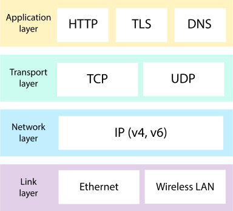

## Сетевые запросы


[все лекции](https://github.com/dmitryweiner/android-lectures/blob/master/README.md)

[видео]()
---

### Стек TCP/IP

---

### HTTP запрос
[Подробнее](https://developer.mozilla.org/ru/docs/Web/HTTP/Overview)


---

### HTTP ответ

---
### Задача
* Написать приложение, отображающее форму:
  <br/><label>
  ID:
  <input><br/>
  </label>
  <button>Получить данные!</button>
* При нажатии кнопки приложение обращается в API:
  https://jsonplaceholder.typicode.com/posts/:id
* Полученные результаты показываются на экране. Поля `title` и `body`:

```json
{
    "userId": 1,
    "id": 4,
    "title": "eum et est occaecati",
    "body": "ullam et saepe reiciendis voluptatem adipisci\nsit amet autem assumenda provident rerum culpa\nquis hic commodi nesciunt rem tenetur doloremque ipsam iure\nquis sunt voluptatem rerum illo velit"
}
```  
---
### Подготовка приложения
* Добавить разрешение на доступ в интернет `android.permission.INTERNET` в AndroidManifest.xml:
```
<?xml version="1.0" encoding="utf-8"?>
<manifest xmlns:android="http://schemas.android.com/apk/res/android"
    xmlns:tools="http://schemas.android.com/tools"
    package="com.example.myapplication">
    <uses-permission android:name="android.permission.INTERNET" />
    <!-- ... -->
</manifest>
```
---
### Подготовка приложения

* Если нужно обращаться к __не HTTPS__ серверам, надо добавить в `<application>` `usesCleartextTraffic`:
```xml
<application
        android:usesCleartextTraffic="true"
>
   <!-- ... -->
</application> 
```
---

### Варианты
* Делать запрос с помощью `HttpURLConnection` из пакета `java.net` (ставить не надо).
* Использовать библиотеку [Ktor](https://ktor.io/) (надо ставить).
---

### Функция для получения данных по URL'у
```kotlin
fun getContent(url: String, timeout: Int = 10000): String? {
    var c: HttpURLConnection? = null
    try {
        val u = URL(url)
        c = u.openConnection() as HttpURLConnection
        c.setRequestMethod("GET")
        c.setRequestProperty("Content-length", "0")
        c.setUseCaches(false)
        c.setAllowUserInteraction(false)
        c.setConnectTimeout(timeout)
        c.setReadTimeout(timeout)
        c.connect()
        val status: Int = c.getResponseCode()
        when (status) {
            200, 201 -> {
                val streamReader = InputStreamReader(c.inputStream)
                var text = ""
                streamReader.use {
                    text = it.readText()
                }
                return text
            }
        }
    } catch (ex: MalformedURLException) {
        Logger.getLogger(javaClass.name).log(Level.SEVERE, null, ex)
    } catch (ex: IOException) {
        Logger.getLogger(javaClass.name).log(Level.SEVERE, null, ex)
    } finally {
        if (c != null) {
            try {
                c.disconnect()
            } catch (ex: Exception) {
                Logger.getLogger(javaClass.name).log(Level.SEVERE, null, ex)
            }
        }
    }
    return null
}
```
---

### Парсим JSON
```kotlin
// соответствует структуре JSON 
// https://jsonplaceholder.typicode.com/posts/1
data class Post(
    val id: Int,
    val userId: Int
    val title: String,
    val body: String,
)

fun getPostById(id: Int): Post? {
    val response = getContent(
        "https://jsonplaceholder.typicode.com/posts/$id",
        1000
    )
    var jsonObject: JSONObject? = null
    try {
        jsonObject = JSONObject(response)
        val post = Post(
            jsonObject.getInt("id"),
            jsonObject.getInt("userId"),
            jsonObject.getString("title"),
            jsonObject.getString("body"),
        )
        return user
    } catch (e: JSONException) {
        e.printStackTrace()
    }
    return null
}
```
* Альтернатива JSONObject: использовать библиотеку [Gson](https://github.com/google/gson/blob/master/UserGuide.md).
---

### Класс APIService
* Создадим класс (в отдельном файле, конечно 😏) `APIService` для хранения этих методов:

```kotlin
class APIService {
    companion object {
        const val BASE_URL = "https://jsonplaceholder.typicode.com"
    }
    private fun getContent(url: String, timeout: Int = 10000): String? {
        // см. ранее
    }
    fun getPostById(id: Int): Post? {
        // см. ранее
    }
}
```
---

### Запрос с помощью потоков
```kotlin
class MainActivity : AppCompatActivity() {
    val apiService = APIService()
    override fun onCreate(savedInstanceState: Bundle?) {
        super.onCreate(savedInstanceState)
        setContentView(R.layout.activity_main)

        val button = findViewById<Button>(R.id.button)
        val textView = findViewById<TextView>(R.id.textView)
        val editText = findViewById<EditText>(R.id.editText)

        button.setOnClickListener {
            thread {
                val id = editText.text.toString().toIntOrNull() ?: 0
                val post = apiService.getPostById(id)
                runOnUiThread {
                    textView.text = post?.body
                }
            }
        }
    }
}
```
---

### Запрос с помощью корутин
* Для работы с корутинами [нужно их поставить](https://dmitryweiner.github.io/android-lectures/Async.html#/).

```kotlin
button.setOnClickListener {
    // Dispatchers.IO для операций ввода-вывода
    lifecycleScope.launch(Dispatchers.IO) {
        val id = editText.text.toString().toIntOrNull() ?: 0
        val post = apiService.getPostById(id)
        // для обращения к UI меняем поток
        withContext(Dispatchers.Main) {
            textViewTitle.text = post?.title
            textViewBody.text = post?.body
        }
    }
}
```
---

### Слишком многословно?
* Приведённое решение страдает многословностью.
* Для удобной работы с API следует пользоваться библиотекой [Retrofit](https://dmitryweiner.github.io/android-lectures/Retrofit.html#/).
---

### Задачи
* Написать приложение, отображающее форму:
  <br/><label>
  ID:
  <input>
  </label>
  <button>Получить данные!</button><br/>
* При нажатии кнопки приложение обращается по адресу https://jsonplaceholder.typicode.com/posts/:id.
* После этого приложение обращается по адресу https://jsonplaceholder.typicode.com/users/:userId,  
  где `userId` получен из предыдущих данных.
* Показать экране: из post - поля `title` и `body`, из user - поля `name`, `email`.
---

### Полезные ссылки
* [Приложение с обращением к API](https://github.com/dmitryweiner/kotlin-api/tree/main/kotlin-api-http)

