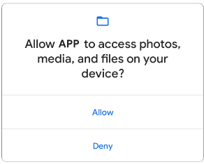

### Получение доступа к системным функциям


[все лекции](https://github.com/dmitryweiner/android-lectures/blob/master/README.md)
---

### Разрешения пользователя
* Приложение получает доступ к различным функциям операционной системы только 
после разрешения пользователя.
* Функции, к которым собирается обращаться приложение, описываются в Manifest.xml.
* [Список всех разрешений](https://developer.android.com/reference/android/Manifest.permission.html).
---

### AndroidManifest.xml
```xml
<?xml version="1.0" encoding="utf-8"?>
<manifest xmlns:android="http://schemas.android.com/apk/res/android"
    package="com.test.someapplication">
 
    <uses-permission android:name="android.permission.INTERNET" />
    <uses-permission android:name="android.permission.READ_CONTACTS" />
    <uses-permission android:name="android.permission.BLUETOOTH" />
    <uses-permission android:name="android.permission.ACCESS_FINE_LOCATION" />
    <uses-permission android:name="android.permission.CAMERA" />
    <uses-permission android:name="android.permission.SEND_SMS" />
 
    <application
    ...
    ></application>
 
</manifest>
```
---

### Виды разрешений

*  Разрешения бывают двух видов:
  * **normal** - показываются только при установке приложения, не требуют дополнительного запроса разрешения.
  * **dangerous** - требуют явного запроса разрешения от пользователя:
  

----

`normal`

```
ACCESS_LOCATION_EXTRA_COMMANDS
ACCESS_NETWORK_STATE
ACCESS_NOTIFICATION_POLICY
ACCESS_WIFI_STATE
BLUETOOTH
BLUETOOTH_ADMIN
BROADCAST_STICKY
CHANGE_NETWORK_STATE
CHANGE_WIFI_MULTICAST_STATE
CHANGE_WIFI_STATE
DISABLE_KEYGUARD
EXPAND_STATUS_BAR
GET_PACKAGE_SIZE
INSTALL_SHORTCUT
INTERNET
KILL_BACKGROUND_PROCESSES
MODIFY_AUDIO_SETTINGS
NFC
READ_SYNC_SETTINGS
READ_SYNC_STATS
RECEIVE_BOOT_COMPLETED
REORDER_TASKS
REQUEST_IGNORE_BATTERY_OPTIMIZATIONS
REQUEST_INSTALL_PACKAGES
SET_ALARM
SET_TIME_ZONE
SET_WALLPAPER
SET_WALLPAPER_HINTS
TRANSMIT_IR
UNINSTALL_SHORTCUT
USE_FINGERPRINT
VIBRATE
WAKE_LOCK
WRITE_SYNC_SETTINGS
```
----

`dangerous`

```
READ_CALENDAR
WRITE_CALENDAR
CAMERA
READ_CONTACTS
WRITE_CONTACTS
GET_ACCOUNTS
ACCESS_FINE_LOCATION
ACCESS_COARSE_LOCATION
RECORD_AUDIO
READ_PHONE_STATE
READ_PHONE_NUMBERS 
CALL_PHONE
ANSWER_PHONE_CALLS 
READ_CALL_LOG
WRITE_CALL_LOG
ADD_VOICEMAIL
USE_SIP
PROCESS_OUTGOING_CALLS
BODY_SENSORS
SEND_SMS
RECEIVE_SMS
READ_SMS
RECEIVE_WAP_PUSH
RECEIVE_MMS
READ_EXTERNAL_STORAGE
WRITE_EXTERNAL_STORAGE
ACCESS_MEDIA_LOCATION
ACCEPT_HANDOVER
ACCESS_BACKGROUND_LOCATION
ACTIVITY_RECOGNITION
```
---

#### Алгоритм запроса разрешения `dangerous` во время выполнения
* Проверить, может уже выдали разрешение:
    * Если да, делаем то, что собирались (запись в файл и т.д.).
    * Если нет, запросить разрешение.
* Запрос разрешения:
    * Если уже спрашивали, но пользователь нажал "нет", можно показать тост, объясняющий, зачем нам это.
    * Иначе запрашиваем разрешение.
* В activity слушаем результат запроса:
    * Если разрешили, делаем, что собирались.
---

### Создадим лончер, запускающий диалог запроса разрешений:

```kotlin
val requestPermissionLauncher =
    registerForActivityResult(RequestPermission()) { isGranted: Boolean ->
        if (isGranted) {
            // Разрешение дали 😊
            // можно делать что собирались
        } else {
            // Разрешение не дали 😭
            // Покажем тост с объяснениями, зачем разрешение
        }
    }
```
---

### В Activity:

```kotlin
fun callPhone(phoneNumber: String) {
    val intent = Intent(Intent.ACTION_CALL, Uri.parse(`tel:$phoneNumber`));
    startActivity(intent);
}

@RequiresApi(Build.VERSION_CODES.M)
fun calPhoneWithPermissions(phoneNumber: String) {
    val requestPermissionLauncher =
        registerForActivityResult(ActivityResultContracts.RequestPermission()) { isGranted: Boolean ->
            if (isGranted) {
                // Разрешение дали 😊
                // можно делать что собирались
            } else {
                // Разрешение не дали 😭
                // Покажем тост с объяснениями, зачем разрешение
            }
        }
    when {
        ContextCompat.checkSelfPermission(
                this,
                Manifest.permission.REQUESTED_PERMISSION
                ) == PackageManager.PERMISSION_GRANTED -> {
                // Разрешение уже дали 😊
                // можно делать что собирались
        }
        shouldShowRequestPermissionRationale(Manifest.permission.REQUESTED_PERMISSION) -> {
                // Уже спрашивали, но его не дали 😭
                // Покажем тост с объяснениями, зачем разрешение
        }
        else -> {
            // Показываем диалог запроса разрешения 🤔
            requestPermissionLauncher.launch(
                    Manifest.permission.REQUESTED_PERMISSION)
        }
    }
}
```
REQUESTED_PERMISSION - то разрешение, которое мы хотим запросить (см. список)
---

### Пример: вызов телефонного номера

* В манифесте:
```xml
<uses-permission android:name="android.permission.CALL_PHONE" />
```

* Код вызова:
```kotlin
val intent = Intent(Intent.ACTION_CALL, Uri.parse(`tel:123456789`));
startActivity(intent);
```
---

### Всё в сборе
```kotlin
fun callPhone(phoneNumber: String) {
    val intent = Intent(Intent.ACTION_CALL, Uri.parse(`tel:$phoneNumber`));
    startActivity(intent);
}

@RequiresApi(Build.VERSION_CODES.M)
fun calPhoneWithPermissions(phoneNumber: String) {
    val requestPermissionLauncher =
        registerForActivityResult(ActivityResultContracts.RequestPermission()) { isGranted: Boolean ->
            if (isGranted) {
                // Разрешение дали 😊
                // можно делать что собирались
                callPhone(phoneNumber)
            } else {
                // Разрешение не дали 😭
                // Покажем тост с объяснениями, зачем разрешение
                Toast.makeText(
                    applicationContext,
                    "Приложению нужно разрешение для телефонных звонков",
                    Toast.LENGTH_SHORT).show()
            }
        }
    when {
        ContextCompat.checkSelfPermission(
                this,
                Manifest.permission.CALL_PHONE
                ) == PackageManager.PERMISSION_GRANTED -> {
                // Разрешение уже дали 😊
                // можно делать что собирались
                callPhone(phoneNumber)
        }
        shouldShowRequestPermissionRationale(Manifest.permission.CALL_PHONE) -> {
                // Уже спрашивали, но его не дали 😭
                // Покажем тост с объяснениями, зачем разрешение
                Toast.makeText(
                    applicationContext,
                    "Приложению нужно разрешение для телефонных звонков",
                    Toast.LENGTH_SHORT).show()
        }
        else -> {
            // Показываем диалог запроса разрешения 🤔
            requestPermissionLauncher.launch(
                    Manifest.permission.CALL_PHONE)
        }
    }
}
```
---

### Запрос нескольких разрешений за раз
``` kotlin
val requestPermissionLauncher =
    registerForActivityResult(ActivityResultContracts.RequestMultiplePermissions()) { permissionsStatusMap ->
        // permissionStatusMap is of type <String, Boolean>
        // if all permissions accepted
        if (!permissionsStatusMap.containsValue(false)) {
            // Разрешение дали 😊
        } else {
            // Разрешение не дали 😭
        }
    }
    
requestPermissionLauncher.launch(
    arrayOf(
        android.Manifest.permission.READ_CONTACTS, 
        android.Manifest.permission.WRITE_CONTACTS, 
        android.Manifest.permission.WRITE_EXTERNAL_STORAGE, 
        android.Manifest.permission.READ_SMS, 
        android.Manifest.permission.CAMERA
    )
)
```
---

### Интересные разрешения
* normal:
    * INTERNET - доступ в интернет.
    * TRANSMIT_IR - передача данных по ИК-связи.
* dangerous:
    * ACCESS_FINE_LOCATION - доступ к GPS.
    * RECORD_AUDIO - доступ к микрофону.
---

### Запись звука
```kotlin
final int RECORDER_SAMPLERATE = 8000;
final int RECORDER_CHANNELS = AudioFormat.CHANNEL_IN_MONO;
final int RECORDER_AUDIO_ENCODING = AudioFormat.ENCODING_PCM_16BIT;
int bufferSize = AudioRecord.getMinBufferSize(RECORDER_SAMPLERATE,
                RECORDER_CHANNELS, RECORDER_AUDIO_ENCODING); 
int BufferElements2Rec = 1024; // want to play 2048 (2K) since 2 bytes we use only 1024
int BytesPerElement = 2; // 2 bytes in 16bit format
short sData[] = new short[BufferElements2Rec];
recorder = new AudioRecord(MediaRecorder.AudioSource.MIC,
        RECORDER_SAMPLERATE, RECORDER_CHANNELS,
        RECORDER_AUDIO_ENCODING, BufferElements2Rec * BytesPerElement);
recorder.startRecording();
while (isRecording) {
    // gets the voice output from microphone to byte format
    recorder.read(sData, 0, BufferElements2Rec);
}
```
----

```kotlin
package com.example.myapplication

import android.Manifest
import android.annotation.SuppressLint
import android.content.pm.PackageManager
import android.media.AudioFormat
import android.media.AudioRecord
import android.media.MediaRecorder
import android.os.Build
import android.os.Bundle
import android.widget.Toast
import androidx.activity.result.contract.ActivityResultContracts
import androidx.annotation.RequiresApi
import androidx.appcompat.app.AppCompatActivity
import androidx.core.content.ContextCompat
import kotlin.concurrent.thread


class MainActivity : AppCompatActivity() {
    @RequiresApi(Build.VERSION_CODES.M)
    override fun onCreate(savedInstanceState: Bundle?) {
        super.onCreate(savedInstanceState)
        setContentView(R.layout.activity_main)

        recordAudioWithPermissions()
    }

    @RequiresApi(Build.VERSION_CODES.M)
    fun recordAudioWithPermissions() {
        val requestPermissionLauncher =
            registerForActivityResult(ActivityResultContracts.RequestPermission()) { isGranted: Boolean ->
                if (isGranted) {
                    // Разрешение дали 😊
                    // можно делать что собирались
                    recordAudio()
                } else {
                    // Разрешение не дали 😭
                    // Покажем тост с объяснениями, зачем разрешение
                    Toast.makeText(
                        applicationContext,
                        "Приложению нужно разрешение для записи звука",
                        Toast.LENGTH_SHORT).show()
                }
            }
        when {
            ContextCompat.checkSelfPermission(
                this,
                Manifest.permission.RECORD_AUDIO
            ) == PackageManager.PERMISSION_GRANTED -> {
                // Разрешение уже дали 😊
                // можно делать что собирались
                recordAudio()
            }
            shouldShowRequestPermissionRationale(Manifest.permission.RECORD_AUDIO) -> {
            // Уже спрашивали, но его не дали 😭
            // Покажем тост с объяснениями, зачем разрешение
            Toast.makeText(
                applicationContext,
                "Приложению нужно разрешение для записи звука",
                Toast.LENGTH_SHORT).show()
        }
            else -> {
                // Показываем диалог запроса разрешения 🤔
                requestPermissionLauncher.launch(
                    Manifest.permission.RECORD_AUDIO)
            }
        }
    }

    @SuppressLint("MissingPermission")
    fun recordAudio() {
        val RECORDER_SAMPLERATE = 8000
        val RECORDER_CHANNELS: Int = AudioFormat.CHANNEL_IN_MONO
        val RECORDER_AUDIO_ENCODING: Int = AudioFormat.ENCODING_PCM_16BIT
        val bufferSize = AudioRecord.getMinBufferSize(
            RECORDER_SAMPLERATE,
            RECORDER_CHANNELS, RECORDER_AUDIO_ENCODING
        )
        val BufferElements2Rec = 1024 // want to play 2048 (2K) since 2 bytes we use only 1024

        val BytesPerElement = 2 // 2 bytes in 16bit format

        val sData = ShortArray(BufferElements2Rec)

        val recorder = AudioRecord(
            MediaRecorder.AudioSource.MIC,
            RECORDER_SAMPLERATE, RECORDER_CHANNELS,
            RECORDER_AUDIO_ENCODING, BufferElements2Rec * BytesPerElement
        )
        thread {
            recorder.startRecording()
            while (true) {
                // gets the voice output from microphone to byte format
                recorder.read(sData, 0, BufferElements2Rec)
                println(sData.max())
            }
        }
    }
}
```
---

### Полезные ссылки
* https://startandroid.ru/ru/blog/508-android-permissions.html
* https://developer.android.com/guide/topics/permissions/overview
* https://source.android.com/docs/core/permissions
