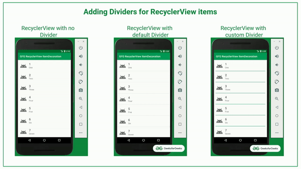
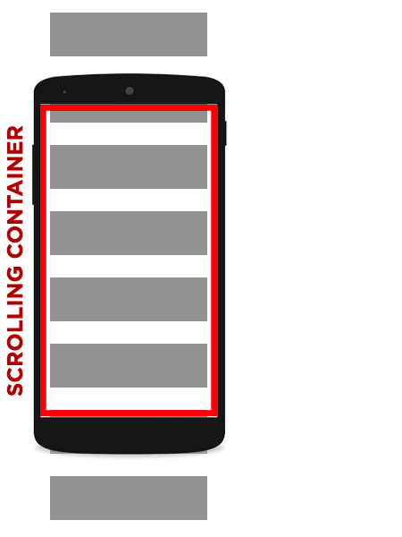
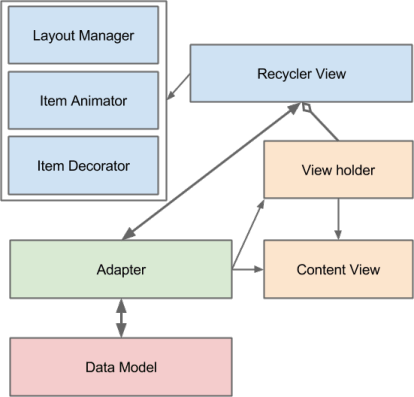

### Recycler View



[все лекции](https://github.com/dmitryweiner/android-lectures/blob/master/README.md)

[видео]()
---

### Идея


---

### Как подключать
* Создать адаптер.
* Скормить адаптеру список.
* Положить адаптер в Recycler View.
* При изменении списка извещать адаптер.
---

### Диаграмма зависимостей

---

### Бесконечный список с текстовыми элементами
* Для иллюстрации идей давайте создадим достаточно большой список строк с возможностью прокрутки.

---

### Создаём разметку для элемента списка
```xml
```
---

### Создаём адаптер
```kotlin
class RecyclerAdapter(private val list: List<String>) : RecyclerView
.Adapter<CustomRecyclerAdapter.MyViewHolder>() {

    override fun getItemCount() = list.size

    override fun onCreateViewHolder(parent: ViewGroup, viewType: Int): ViewHolder {
        val itemView = LayoutInflater.from(parent.context)
            .inflate(R.layout.list_item, parent, false)
        return MyViewHolder(itemView)
    }

    override fun onBindViewHolder(holder: MyViewHolder, position: Int) {
        holder.largeTextView.text = list[position]
    }

    class ViewHolder(itemView: View) : RecyclerView.ViewHolder(itemView) {
        val largeTextView: TextView = itemView.findViewById(R.id.textViewLarge)
        val smallTextView: TextView = itemView.findViewById(R.id.textViewSmall)
    }
}
```
---

###

---

###

---

###

---

###

---

###

---

###

---

### Кастомная разметка элементов списка

---

###

---

###

---

###

---

###

---

###

---

###

---

###

---

###

---

### Полезные ссылки
* http://developer.alexanderklimov.ru/android/views/recyclerview-kot.php
* https://habr.com/ru/company/otus/blog/579208/