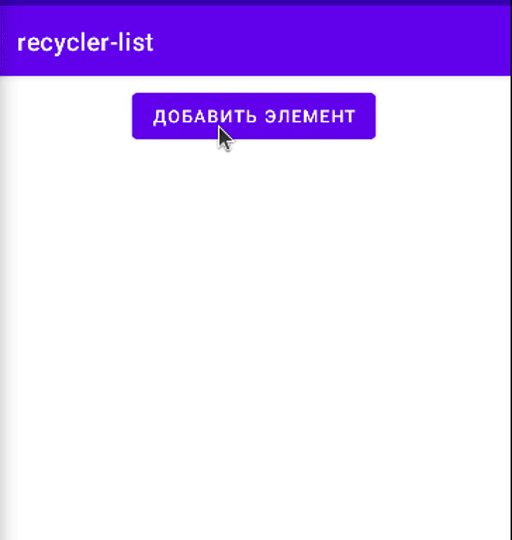
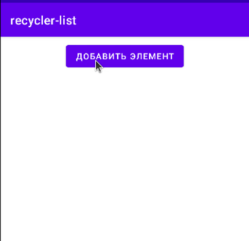

### Recycler View


[все лекции](https://github.com/dmitryweiner/android-lectures/blob/master/README.md)

[видео]()
---

### Идея


---

### Как подключать
* Описать адаптер.
* Скормить адаптеру список.
* Положить адаптер в Recycler View.
* При изменении списка извещать адаптер.
---

### Диаграмма зависимостей

---

### Бесконечный список с текстовыми элементами
* Для иллюстрации идей давайте создадим достаточно большой список строк с возможностью прокрутки.


---

### Создаём разметку для элемента списка
* `res/layout/list_item.xml`:

```xml
<?xml version="1.0" encoding="utf-8"?>
<LinearLayout
    xmlns:android="http://schemas.android.com/apk/res/android"
    android:layout_width="match_parent"
    android:layout_height="wrap_content"
    android:orientation="vertical">

    <TextView
        android:id="@+id/textView"
        android:layout_width="wrap_content"
        android:layout_height="wrap_content"
        android:textAppearance="?android:attr/textAppearanceSmall"
        android:textSize="24sp" />
</LinearLayout>
```
---

### Разметка основного экрана
* `res/layout/activity_main.xml`

```xml
<?xml version="1.0" encoding="utf-8"?>
<androidx.constraintlayout.widget.ConstraintLayout xmlns:android="http://schemas.android.com/apk/res/android"
    xmlns:app="http://schemas.android.com/apk/res-auto"
    xmlns:tools="http://schemas.android.com/tools"
    android:layout_width="match_parent"
    android:layout_height="match_parent"
    tools:context=".MainActivity">

    <androidx.recyclerview.widget.RecyclerView
        android:id="@+id/recyclerView"
        android:layout_width="match_parent"
        android:layout_height="match_parent" />
</androidx.constraintlayout.widget.ConstraintLayout>
```
---

### Создаём адаптер
```kotlin
class RecyclerAdapter(private val list: List<String>): RecyclerView.Adapter<RecyclerAdapter.ViewHolder>() {
    override fun onCreateViewHolder(parent: ViewGroup, viewType: Int): ViewHolder {
        val itemView = LayoutInflater.from(parent.context)
            .inflate(R.layout.list_item, parent, false)
        return ViewHolder(itemView)
    }

    override fun onBindViewHolder(holder: ViewHolder, position: Int) {
        holder.textView.text = list[position]
    }

    override fun getItemCount(): Int {
        return list.size
    }

    class ViewHolder(itemView: View): RecyclerView.ViewHolder(itemView) {
        val textView = itemView.findViewById<TextView>(R.id.textView)
    }
}
```
---

### Методы и классы адаптера
* `onCreateViewHolder` на основе XML-разметки создаёт View и кладёт его во ViewHolder.
* `onBindViewHolder` при прокрутке View обновляет своё содержимое для элемента, который оказался на экране.
* `getItemCount` определяет общее число элементов.
* `class ViewHolder` класс для доступа к элементу списка.
---

### Собираем всё вместе:
* В `Activity.onCreate`:

```kotlin
// заполняем список
val list = mutableListOf<String>()
for (i in 0..100) {
    list.add(Math.random().toString())
}

// создаём инстанс адаптера, отдаём ему список
val adapter = RecyclerAdapter(list)

val recyclerView = findViewById<RecyclerView>(R.id.recyclerView)
// у нас будет линейный список
recyclerView.layoutManager = LinearLayoutManager(this)
// прикручиваем адаптер к RecyclerView
recyclerView.adapter = adapter
```
---

### Результат
* Результат можно посмотреть в этом [репозитории](https://github.com/dmitryweiner/recycler-list-kotlin/tree/59a7480056a5418f86ba95602caaa41a400a5baa).


---

### Список с возможностью добавления элементов
* Сверху будет кнопка "Добавить элемент".
* При нажатии на кнопку добавляется новый элемент в начало списка.
* `res/layout/list_item.xml` и `RecyclerAdapter` останутся прежними.
* При добавлении нужно будет извещать адаптер об изменении данных.
---

### Разметка основного экрана
* `res/layout/activity_main.xml`

```xml
<?xml version="1.0" encoding="utf-8"?>
<androidx.constraintlayout.widget.ConstraintLayout xmlns:android="http://schemas.android.com/apk/res/android"
    xmlns:app="http://schemas.android.com/apk/res-auto"
    xmlns:tools="http://schemas.android.com/tools"
    android:layout_width="match_parent"
    android:layout_height="match_parent"
    tools:context=".MainActivity">

    <Button
        android:id="@+id/button"
        android:layout_width="wrap_content"
        android:layout_height="wrap_content"
        android:layout_marginTop="8dp"
        android:layout_marginBottom="8dp"
        android:text="Добавить элемент"
        app:layout_constraintBottom_toTopOf="@+id/recyclerView"
        app:layout_constraintEnd_toEndOf="parent"
        app:layout_constraintHorizontal_bias="0.5"
        app:layout_constraintStart_toStartOf="parent"
        app:layout_constraintTop_toTopOf="parent"
        app:layout_constraintVertical_chainStyle="spread_inside" />

    <androidx.recyclerview.widget.RecyclerView
        android:id="@+id/recyclerView"
        android:layout_width="match_parent"
        android:layout_height="0dp"
        app:layout_constraintBottom_toBottomOf="parent"
        app:layout_constraintTop_toBottomOf="@+id/button"
        app:layout_constraintVertical_chainStyle="spread_inside"
        tools:layout_editor_absoluteX="1dp" />
</androidx.constraintlayout.widget.ConstraintLayout>
```
---

### Activity
* В `Activity.onCreate`:

```kotlin
val list = mutableListOf<String>()
val adapter = RecyclerAdapter(list)
val recyclerView = findViewById<RecyclerView>(R.id.recyclerView)
recyclerView.layoutManager = LinearLayoutManager(this)
recyclerView.adapter = adapter

val buttonAdd = findViewById<Button>(R.id.button)
// реакция на нажатие
buttonAdd.setOnClickListener {
    // добавляем элемент в список
    list.add(Math.random().toString())
    
    // извещаем адаптер об изменениях
    adapter.notifyItemInserted(list.lastIndex)
}
```
---

### Результат 

[Репозиторий](https://github.com/dmitryweiner/recycler-list-kotlin/tree/3eaa968cde714f62e423e0b658d484a61e4b8ced)


---

### Способы извещения адаптера
* Для лучшей производительности предпочтительнее указывать, что конкретно произошло:
  * `notifyItemInserted` - добавили элемент.
  * `notifyItemChanged` - изменили элемент.
  * `notifyItemRemoved` - удалили.
  * `notifyItemMoved` - переместили в другое место списка.
* И лишь в качестве самого последнего варианта можно использовать `notifyDataSetChanged`, перерисовывающего весь список. 
---

### Список с добавлением и удалением
* Кнопка "Добавить" добавляет.
* Каждый элемент списка помимо текста содержит кнопку "Удалить", при нажатии на которую элемент удаляется.
* При изменении списка нужно будет извещать адаптер об изменении данных.
* Разметка основного экрана `res/layout/activity_main.xml` остаётся прежней.
---

### Разметка элемента списка
* `res/layout/list_item.xml`:

```xml
<?xml version="1.0" encoding="utf-8"?>
<LinearLayout
    xmlns:android="http://schemas.android.com/apk/res/android"
    android:layout_width="match_parent"
    android:layout_height="wrap_content"
    android:orientation="horizontal">
    <TextView
        android:id="@+id/textView"
        android:layout_width="0dp"
        android:layout_height="wrap_content"
        android:layout_weight="1"
        android:textAppearance="?android:attr/textAppearanceSmall"
        android:textSize="24sp" />
    <Button
        android:id="@+id/button"
        android:layout_width="40dp"
        android:layout_height="wrap_content"
        android:backgroundTint="@color/purple_200"
        android:text="❌" />
</LinearLayout>
```
---

### Адаптер
```kotlin
class RecyclerAdapter(
    private val list: List<String>,
    // передаём коллбек нажатия на кнопку
    private val onItemClick: (id: Int) -> Unit
) : RecyclerView.Adapter<RecyclerAdapter.ViewHolder>() {
    override fun onCreateViewHolder(parent: ViewGroup, viewType: Int): ViewHolder {
        val itemView = LayoutInflater.from(parent.context)
            .inflate(R.layout.list_item, parent, false)
        return ViewHolder(itemView)
    }

    override fun onBindViewHolder(holder: ViewHolder, position: Int) {
        holder.textView.text = list[position]
        // обработчик нажатия кнопки
        holder.button.setOnClickListener {
            onItemClick(holder.adapterPosition)
        }
    }

    override fun getItemCount(): Int {
        return list.size
    }

    class ViewHolder(itemView: View) : RecyclerView.ViewHolder(itemView) {
        val textView = itemView.findViewById<TextView>(R.id.textView)
        // находим кнопку
        val button = itemView.findViewById<TextView>(R.id.button)
    }
}
```
---

### Activity
```kotlin
class MainActivity : AppCompatActivity() {
    private val list = mutableListOf<String>()
    private lateinit var adapter: RecyclerAdapter

    override fun onCreate(savedInstanceState: Bundle?) {
        super.onCreate(savedInstanceState)
        setContentView(R.layout.activity_main)

        adapter = RecyclerAdapter(list) {
            // адаптеру передали обработчик удаления элемента
            list.removeAt(it)
            adapter.notifyItemRemoved(it)
        }

        val recyclerView = findViewById<RecyclerView>(R.id.recyclerView)
        recyclerView.layoutManager = LinearLayoutManager(this)
        recyclerView.adapter = adapter

        val buttonAdd = findViewById<Button>(R.id.button)
        buttonAdd.setOnClickListener {
            list.add(Math.random().toString())
            adapter.notifyItemInserted(list.lastIndex)
        }
    }
}
```
---

### Результат

[Репозиторий](https://github.com/dmitryweiner/recycler-list-kotlin/tree/2887698dc444706d60527ff4dfa85fd67e780433)


---

### Задачи
* Список чисел:
<br/><input><button>+</button><br/>
<ul style="width: 200px; height: 150px; overflow-y: scroll"><li>1</li><li>3</li><li>15</li><li>22</li><li>14</li><li>47</li><li>2</li></ul>
При нажатии на [+] в список добавляется очередное число из поля ввода.
---

### Задачи
* Список чисел с удалением:
<br/><input><button>+</button><br/>
<ul style="width: 200px; height: 150px; overflow-y: scroll"><li>1</li><li>3</li><li>15</li><li>22</li><li>14</li><li>47</li><li>2</li></ul>
При клике на число оно удаляется из списка. 
---

### Задачи
* Список чисел c фильтрацией:
<br/><input><button>+</button><br/>
<label><input name="filter" type="radio" value="Все" checked="">Все</label><label><input name="filter" type="radio" value="Сделанные">Четные</label><label><input name="filter" type="radio" value="Не сделанные">Нечетные</label>
<ul style="width: 200px; height: 150px; overflow-y: scroll"><li>1</li><li>3</li><li>15</li><li>22</li><li>14</li><li>47</li><li>2</li></ul>
При изменении состояния фильтра список обновляется. 
---

### Полезные ссылки
* https://developer.alexanderklimov.ru/android/views/recyclerview-kot.php
* https://habr.com/ru/company/otus/blog/579208/