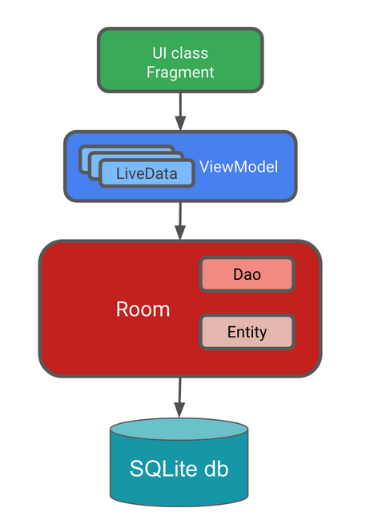

### Библиотека Room для доступа к БД SQLite

[все лекции](https://github.com/dmitryweiner/android-lectures/blob/master/README.md)

[видео]()
---


---

### Установка
* project build.gradle: 
```
allprojects {
    repositories {
        jcenter()
        google() // <---
    }
    ...
}
```
* app build.gradle: 
```
dependencies {
    implementation "android.arch.persistence.room:runtime:1.0.0"
    annotationProcessor "android.arch.persistence.room:compiler:1.0.0"
    ...
}
```
 
---

### Entity
```kotlin
@Entity
public class Employee {
 
   @PrimaryKey
   public long id;
 
   public String name;
 
   public int salary;
}
```
---

### DAO
```kotlin
@Dao
public interface EmployeeDao {
 
   @Query("SELECT * FROM employee")
   List<Employee> getAll();
 
   @Query("SELECT * FROM employee WHERE id = :id")
   Employee getById(long id);
 
   @Insert
   void insert(Employee employee);
 
   @Update
   void update(Employee employee);
 
   @Delete
   void delete(Employee employee);
 
}
```
---

### Database
```
@Database(entities = {Employee.class}, version = 1)
public abstract class AppDatabase extends RoomDatabase {
   public abstract EmployeeDao employeeDao();
}
```
---

### Подключение к БД в Activity
```kotlin
AppDatabase db =  Room.databaseBuilder(getApplicationContext(),
       AppDatabase.class, "database")
       .allowMainThreadQueries() // выполняемся в основном потоке
       .build();
       
EmployeeDao employeeDao = db.employeeDao();
```
---

### Использование Room
```kotlin
// INSERT
Employee employee = new Employee();
employee.id = 1;
employee.name = "John Smith";
employee.salary = 10000;
employeeDao.insert(employee);

// SELECT *
List<Employee> employees = employeeDao.getAll();

// SELECT * WHERE id = 1
Employee employee = employeeDao.getById(1);

// UPDATE
employee.salary = 20000;
employeeDao.update(employee);

// DELETE
employeeDao.delete(employee);
```
---

### Минусы
```kotlin
AppDatabase db =  Room.databaseBuilder(getApplicationContext(),
       AppDatabase.class, "database")
       .allowMainThreadQueries() // <-- !!!
       .build();
```
* Запросы выполняются синхронно в основном (UI) потоке.
* Объект Database создаётся каждый раз при создании Activity.
---

### Постоянный объект Database
* Будем хранить ссылку на Database в самом классе:

```kotlin
@Database(
    entities = [Note::class],
    version = 1,
    exportSchema = true
)
abstract class NoteDatabase : RoomDatabase() {

    abstract fun noteDao(): NoteDao

    companion object {

        @Volatile
        private var INSTANCE: NoteDatabase? = null

        fun getDatabase(context: Context): NoteDatabase {
            // if the INSTANCE is not null, then return it,
            // if it is, then create the database
            if (INSTANCE == null) {
                synchronized(this) {
                    // Pass the database to the INSTANCE
                    INSTANCE = buildDatabase(context)
                }
            }
            // Return database.
            return INSTANCE!!
        }

        private fun buildDatabase(context: Context): NoteDatabase {
            return Room.databaseBuilder(
                context.applicationContext,
                NoteDatabase::class.java,
                "notes_database"
            )
                .build()
        }
    }
}
```
---

### Поток выполнения теперь свой собственный!
```kotlin
return Room.databaseBuilder(
    context.applicationContext,
    NoteDatabase::class.java,
    "notes_database"
) // нет allowMainThreadQueries
    .build()
```
---

### Асинхронный доступ к БД
Используются [корутины](https://metanit.com/kotlin/tutorial/8.1.php#:~:text=%D0%92%20%D1%8F%D0%B7%D1%8B%D0%BA%D0%B5%20Kotlin%20%D0%BF%D0%BE%D0%B4%D0%B4%D0%B5%D1%80%D0%B6%D0%BA%D0%B0%20%D0%B0%D1%81%D0%B8%D0%BD%D1%85%D1%80%D0%BE%D0%BD%D0%BD%D0%BE%D1%81%D1%82%D0%B8,coroutines.). 

```kotlin
lifecycleScope.launch {
    noteDatabase.updateNote(editedNote)
}
```
---

### Подписка на изменения
```kotlin
override fun onCreate(savedInstanceState: Bundle?) {
    super.onCreate(savedInstanceState)
    setContentView(R.layout.activity_notes)
    
    // ...

    observeNotes()
}
private fun observeNotes() {
    lifecycleScope.launch {
        noteDatabase.getNotes().collect { notesList ->
            if (notesList.isNotEmpty()) {
                adapter.submitList(notesList)
            }
        }
    }
}
```
---

### Миграции в Room
* Автоматические:
```kotlin
// BEFORE

@Database(
    entities = [Note::class],
    version = 1,
    exportSchema = true
)

// AFTER

@Database(
    entities = [Note::class],
    autoMigrations = [
        AutoMigration (from = 1, to = 2)
    ],
    version = 2,
    exportSchema = true
)
```
* Ручные:
```kotlin
@Database(
    entities = [Note::class],
    version = 2,
    exportSchema = false
)
@TypeConverters(NoteConverters::class)
abstract class NoteDatabase : RoomDatabase() {

    // ...

    companion object {

        // ...

        private val MIGRATION_1_2: Migration = object : Migration(1, 2) {
            override fun migrate(database: SupportSQLiteDatabase) {
                // The following query will add a new column called lastUpdate to the notes database
                database.execSQL("ALTER TABLE notes ADD COLUMN lastUpdate INTEGER NOT NULL DEFAULT 0")
            }
        }

        private fun buildDatabase(context: Context): NoteDatabase {
            return Room.databaseBuilder(
                context.applicationContext,
                NoteDatabase::class.java,
                "notes_database"
            )
                .addMigrations(MIGRATION_1_2)
                .build()
        }
    }
}
```
---


---

### Полезные ссылки
* https://developer.android.com/codelabs/android-room-with-a-view-kotlin#0
* https://startandroid.ru/ru/courses/architecture-components/27-course/architecture-components/529-urok-5-room-osnovy.html
* https://johncodeos.com/how-to-use-room-in-android-using-kotlin/
#### Проекты с использованием Room
* https://github.com/johncodeos-blog/RoomExample
* https://github.com/irontec/android-room-example/