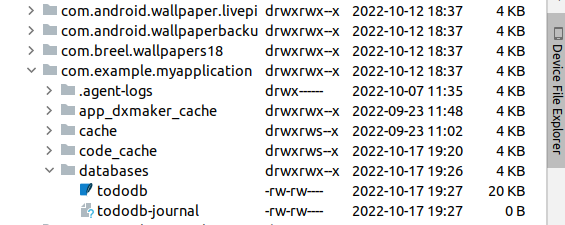
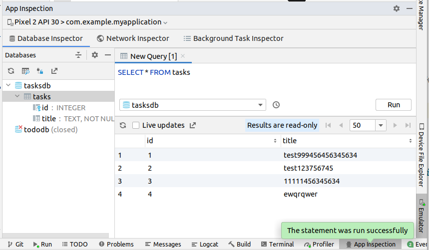

### БД SQLite и подключение к ней в приложении на Android


[все лекции](https://github.com/dmitryweiner/android-lectures/blob/master/README.md)

[видео](https://youtu.be/taHhb1_6mUk)
---

> SQLite — это быстрая и легкая встраиваемая однофайловая СУБД на языке C, которая не имеет сервера и позволяет хранить всю базу локально на одном устройстве. Для работы SQLite не нужны сторонние библиотеки или службы.

[Подробнее](https://blog.skillfactory.ru/glossary/sqlite/)
---

### SQLite
* [Документация](https://www.sqlite.org/docs.html), [rus](https://metanit.com/sql/sqlite/).
* [Программа для работы с базой](https://sqlitebrowser.org/).
* [Работа с базой онлайн](https://sqliteonline.com/).
---

### Типы данных
SQLite поддерживает только четыре типа данных, которые реализованы в SQL:
* INTEGER — целое число;
* REAL — дробное число;
* TEXT — текст;
* BLOB — двоичные данные.
Также существует особое значение NULL — отсутствие данных.
---

### Техническое задание
* Написать приложение для хранения списка дел в БД.
* Пользователь может:
  * просматривать список,
  * отмечать дела выполненными,
  * удалять дела,
  * добавлять новые дела.
---

### Создадим адаптер для доступа к БД
* Создать класс `DBHelper`, наследник `SQLiteOpenHelper`.

```kotlin
class DBHelper() : SQLiteOpenHelper() {
  // ...
}
```
---

### Методы адаптера
* У него будут методы:
    * `onCreate` - метод вызывается системой при создании базы. 
    * `onUpgrade` - при установке новой версии приложения.
    * `getAll` - мы вызываем для получения всех записей.
    * `add` - для добавления записи.
    * `update` - для обновления записи.
    * `remove` - для удаления записи.
---
### Костяк адаптера для доступа к БД
```kotlin
class DBHelper(context: Context?) :
    SQLiteOpenHelper(context, DATABASE_NAME, null, DATABASE_VERSION) {
        
    // статические константы имеет смысл хранить так:
    companion object {
        // версия БД
        const val DATABASE_VERSION = 1
        // название БД
        const val DATABASE_NAME = "tododb"
        // название таблицы
        const val TABLE_NAME = "todos"
        // названия полей
        const val KEY_ID = "id"
        const val KEY_TITLE = "title"
        const val KEY_IS_DONE = "is_done"
    }
        
    override fun onCreate(db: SQLiteDatabase) {
        // создание БД, если она ещё не создана
    }

    override fun onUpgrade(db: SQLiteDatabase, oldVersion: Int, newVersion: Int) {
        // обновление БД
    }
}
```
---

### onCreate
* В этом методе пишем код, который создаёт таблицы в БД:

```kotlin
override fun onCreate(db: SQLiteDatabase) {
    db.execSQL("""
        CREATE TABLE $TABLE_NAME (
            $KEY_ID INTEGER PRIMARY KEY AUTOINCREMENT,
            $KEY_TITLE TEXT NOT NULL,
            $KEY_IS_DONE INTEGER NOT NULL
        )""")
}
```
---

### onUpgrade
* Тут пишем код, который выполняется при обновлении БД (изменении DATABASE_VERSION). 
В данном случае можно просто пересоздать таблицы:

```kotlin
override fun onUpgrade(db: SQLiteDatabase, oldVersion: Int, newVersion: Int) {
    db.execSQL("DROP TABLE IF EXISTS $TABLE_NAME")
    onCreate(db)
}
```
---

### Создадим класс, соответствующий элементу таблицы todos
```kotlin
data class Todo(
  val id: Int,
  val title: String,
  val isDone: Boolean
)
```
---
### Получение всех записей
```kotlin
fun getAll(): List<Todo> {
    val result = mutableListOf<Todo>()
    val database = this.writableDatabase
    val cursor: Cursor = database.query(
        TABLE_NAME, null, null, null,
        null, null, null
    )
    if (cursor.moveToFirst()) {
        val idIndex: Int = cursor.getColumnIndex(KEY_ID)
        val titleIndex: Int = cursor.getColumnIndex(KEY_TITLE)
        val isDoneIndex: Int = cursor.getColumnIndex(KEY_IS_DONE)
        do {
            val todo = Todo(
                cursor.getInt(idIndex),
                cursor.getString(titleIndex),
                cursor.getInt(isDoneIndex) == 1
            )
            result.add(todo)
        } while (cursor.moveToNext())
    }
    cursor.close()
    return result
}
```
---

### Добавление записи
```kotlin
fun add(title: String, isDone: Boolean = false): Long {
    val database = this.writableDatabase
    val contentValues = ContentValues()
    contentValues.put(KEY_TITLE, title)
    contentValues.put(KEY_IS_DONE, if (isDone) 1 else 0)
    // свежедобавленный ID
    val id = database.insert(TABLE_NAME, null, contentValues)
    close()
    return id
}
```
---

### Обновление записи
```kotlin
fun update(id: Int, title: String, isDone: Boolean) {
    val database = this.writableDatabase
    val contentValues = ContentValues()
    contentValues.put(KEY_TITLE, title)
    contentValues.put(KEY_IS_DONE, if (isDone) 1 else 0)
    database.update(TABLE_NAME, contentValues, "$KEY_ID = ?", arrayOf(id.toString()))
    close()
}
```
---

### Удаление записи
```kotlin
fun remove(id: Int) {
    val database = this.writableDatabase
    database.delete(TABLE_NAME, "$KEY_ID = ?", arrayOf(id.toString()))
    close()
}
```
---

### Адаптер в сборе
```kotlin
package com.example.myapplication

import android.content.ContentValues
import android.content.Context
import android.database.Cursor
import android.database.sqlite.SQLiteDatabase
import android.database.sqlite.SQLiteOpenHelper

data class Todo(val id: Long, val title: String, val isDone: Boolean)

class DBHelper(context: Context?) :
    SQLiteOpenHelper(context, DATABASE_NAME, null, DATABASE_VERSION) {
    
    companion object {
        const val DATABASE_VERSION = 1
        const val DATABASE_NAME = "tododb"
        const val TABLE_NAME = "todos"
        const val KEY_ID = "id"
        const val KEY_TITLE = "title"
        const val KEY_IS_DONE = "is_done"
    }
        
    override fun onCreate(db: SQLiteDatabase) {
        db.execSQL("""
            CREATE TABLE $TABLE_NAME (
                $KEY_ID INTEGER PRIMARY KEY AUTOINCREMENT,
                $KEY_TITLE TEXT NOT NULL,
                $KEY_IS_DONE INTEGER NOT NULL
            )""")
    }

    override fun onUpgrade(db: SQLiteDatabase, oldVersion: Int, newVersion: Int) {
        db.execSQL("DROP TABLE IF EXISTS $TABLE_NAME")
        onCreate(db)
    }

    fun getAll(): List<Todo> {
        val result = mutableListOf<Todo>()
        val database = this.writableDatabase
        val cursor: Cursor = database.query(
            TABLE_NAME, null, null, null,
            null, null, null
        )
        if (cursor.moveToFirst()) {
            val idIndex: Int = cursor.getColumnIndex(KEY_ID)
            val titleIndex: Int = cursor.getColumnIndex(KEY_TITLE)
            val isDoneIndex: Int = cursor.getColumnIndex(KEY_IS_DONE)
            do {
                val todo = Todo(
                    cursor.getLong(idIndex),
                    cursor.getString(titleIndex),
                    cursor.getInt(isDoneIndex) == 1
                )
                result.add(todo)
            } while (cursor.moveToNext())
        }
        cursor.close()
        return result
    }

    fun add(title: String, isDone: Boolean = false): Long {
        val database = this.writableDatabase
        val contentValues = ContentValues()
        contentValues.put(KEY_TITLE, title)
        contentValues.put(KEY_IS_DONE, if (isDone) 1 else 0)
        val id = database.insert(TABLE_NAME, null, contentValues)
        close()
        return id
    }

    fun update(id: Long, title: String, isDone: Boolean) {
        val database = this.writableDatabase
        val contentValues = ContentValues()
        contentValues.put(KEY_TITLE, title)
        contentValues.put(KEY_IS_DONE, if (isDone) 1 else 0)
        database.update(TABLE_NAME, contentValues, "$KEY_ID = ?", arrayOf(id.toString()))
        close()
    }

    fun remove(id: Long) {
        val database = this.writableDatabase
        database.delete(TABLE_NAME, "$KEY_ID = ?", arrayOf(id.toString()))
        close()
    }

    fun removeAll() {
        val database = this.writableDatabase
        database.delete(TABLE_NAME, null, null)
        close()
    }
}
```
---

### Пример использования в Activity
```kotlin
// создать экземпляр класса DBHelper
val dbHelper = DBHelper(this)

// добавление записи в таблицу
val id = dbHelper.add("Покормить кота") // в id свежесгенерированное ID из базы

// получение всех записей
val list = mutableListOf<Todo>() // список, который потом привязывается к RecyclerAdapter
list.addAll(dbHelper.getAll())

// удаление элемента
dbHelper.remove(id)
```
---

### Где лежит БД
* Device File Explorer: `/data/data/%PACKAGE_NAME%/databases`:


---

### Доступ к БД на устройстве

* App Inspection -> Database Inspector:


---

### Минусы описанного подхода
* Выполнение запросов в том же потоке, что и UI:
  * Во время тяжёлых запросов интерфейс замирает.
* Отсутствует модель данных и DAO.
  * Тяжело добавить/изменить таблицы.
  * Тяжело добавить/изменить поля.
  * Тяжело переписать под другую БД.
* Вывод: надо использовать библиотеку Room.
---

### Задачи 
* Список строк [RecyclerView](https://dmitryweiner.github.io/android-lectures/Recycler-view.html#/) 
с возможностью добавления и удаления:
<br/><input><button>➕</button><br/>
<ul style="width: 200px; height: 150px; overflow-y: scroll">
<li>олух <button>❌</button></li>
<li>пузырь <button>❌</button></li>
<li>остаток <button>❌</button></li>
<li>уловка <button>❌</button></li>
</ul>
При нажатии на [➕] в список добавляется очередная строка из поля ввода.
При клике на [❌] на элементе списка происходит удаление элемента.
При повороте устройства данные сохраняются.
Данные должны лежать в БД SQLite.
---

### Полезные ссылки
* https://developer.alexanderklimov.ru/android/sqlite/android-sqlite.php
* https://metanit.com/sql/sqlite/
* https://developer.android.com/training/data-storage/sqlite
* [Репозиторий с уже реализованным сохранением в SQLite](https://github.com/dmitryweiner/kotlin-sqlite-todolist).
---

<iframe width="560" height="315" src="https://www.youtube.com/embed/tQot9NMbtiw" title="YouTube video player" frameborder="0" allow="accelerometer; autoplay; clipboard-write; encrypted-media; gyroscope; picture-in-picture" allowfullscreen></iframe>