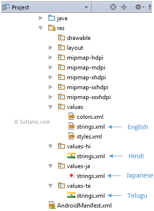

### 📝 Использование строковых ресурсов в приложении

[все лекции](https://github.com/dmitryweiner/android-lectures/blob/master/README.md)
---

### Типы строковых ресурсов
* String - просто строка.
* String array - набор строк.
* Quantity strings - строки с числительными (для плюрализации).
---

### Использование строк
* Строки лежат в файле `res/values/strings.xml`:
```xml
<?xml version="1.0" encoding="utf-8"?>
<resources>
    <string name="hello">Hello!</string>
</resources>
```

* Использование в коде:
```kotlin
val s = resources.getText(R.string.hello)
println(s) // "Hello!"
```
---

### Использование строк лейаутах

```xml
<TextView
    android:layout_width="fill_parent"
    android:layout_height="wrap_content"
    android:text="@string/hello" />
```

<input type="text" value="Hello!" />
---

### Строки с переносами
* Строку с переносами можно обернуть в двойные кавычки `""`:
```xml
<resources>
    <string name="multiline_text">"олег работал программистом
четыре года восемь дней
одиннадцать часов пятнадцать
минут и сорок пять секунд"</string>
</resources>
```
---

### Массивы строк

* Набор строк, объединённых одним смыслом, можно хранить в массиве:

```xml
<?xml version="1.0" encoding="utf-8"?>
<resources>
    <string-array name="planets">
        <item>Меркурий</item>
        <item>Венера</item>
        <item>Земля</item>
        <item>Марс</item>
    </string-array>
</resources>
```

* Использование в коде:

```kotlin
val planets: Array = resources.getStringArray(R.array.planets)
printr(planets.joinToString(",")) // Меркурий, Венера, Земля, Марс
```
---

### Массивы строк

* Тот же массив можно использовать прямо в лейауте:

```xml
<Spinner
    android:layout_width="fill_parent"
    android:layout_height="wrap_content"
    android:entries="@array/planets"
/>
```
---

### Шаблонные строки с параметрами

* Иногда бывает нужно вставлять в строки какие-нибудь подстроки (например, имя). 
Это можно делать с помощью конструкций вида `%1$s`:

```xml
<string name="welcome_message">
    Привет, %1$s! У вас %2$d новых сообщений.
</string>
```
---

### Шаблонные строки с параметрами

* `%[parameter_index$][format_type]`:
  * `parameter index` - Номер параметра (чтоб отличать их, если порядок изменится в другом языке).
  * `format type` - тип параметра:
    * `s` - string.
    * `d` - decimal integer.
    * `f` - floating point number.
---

### Шаблонные строки с параметрами

* Наполнение параметров значениями:

```kotlin
// R.string.welcome_message = "Привет, %1$s! У вас %2$d новых сообщений."
val s = resources.getText(
    R.string.welcome_message, 
    "Вася", // первый параметр
    6 // второй параметр
)
println(s) // "Привет, Вася! У вас 6 новых сообщений."
```
---

### Плюрализация

* Если нужно выводить разные строки в зависимости от количества:
  * У вас 0 новых сообщений.
  * У вас 1 новое сообщение.
  * У вас 2 новых сообщения.
  * У вас 99 новых сообщений.
* Это можно сделать с помощью:

```xml
<plurals name="messages">
    <item quantity="zero">У вас %1$d новых сообщений.</item>
    <item quantity="one">У вас %1$d новое сообщение.</item>
    <item quantity="two">У вас %1$d новых сообщения.</item>
    <item quantity="few">У вас %1$d новых сообщения.</item>
    <item quantity="other">У вас %1$d новых сообщений.</item>
</plurals>
```
---

### Плюрализация
* Варианты `quantity`:
  * "zero" - 0
  * "one" - 1
  * "two" - 2
  * "few" - 2, 3, 4
  * "many" - > 4
  * "other" - любое другое число

```xml
<?xml version="1.0" encoding="utf-8"?>
<resources>
    <plurals name="plural_name">
        <item quantity=["zero" | "one" | "two" | "few" | "many" | "other"]>text_string</item>
    </plurals>
</resources>
```
---

### Плюрализация

* Использование в коде:

```kotlin
val s = resources.getQuantityString(
    R.plurals.messages, 
    3, // количество 
    3  // что выводить
)
println(s) // "У вас 3 новых сообщения."
```

```kotlin
val s = resources.getQuantityString(
    R.plurals.messages, 
    0, // количество 
    0  // что выводить
)
println(s) // "У вас 0 новых сообщений."
```
---

### Мультиязычность


---

### Полезные ссылки
* https://developer.android.com/guide/topics/resources/string-resource
* https://stackoverflow.com/questions/3656371/is-it-possible-to-have-placeholders-in-strings-xml-for-runtime-values
* https://www.tutlane.com/tutorial/android/android-localization-multi-language-with-examples
